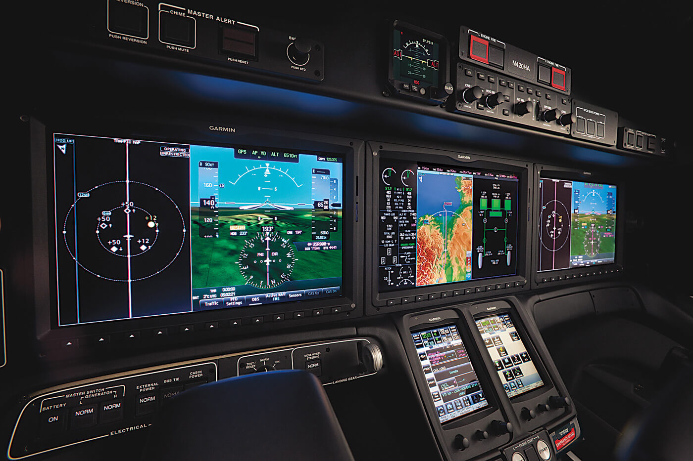

# PERF Avionics Acronyms

---

## Table of Contents (by letter)

[A](#A)
[B](#B)
[C](#C)
[D](#D)
[E](#E)
[F](#F)
[G](#G)
[H](#H)
[I](#I)
[J](#J)
[K](#K)
[L](#L)
[M](#M)
[N](#N)
[O](#O)
[P](#P)
[Q](#Q)
[R](#R)
[S](#S)
[T](#T)
[U](#U)
[V](#V)
[W](#W)
[X](#X)
[Z](#Z)
[Y](#Y)

### A
- **3D**, 4D three- or four-dimensional
- **3G** third generation
- **3GCN** third generation cabin network
- **4096** CODE the octal base, four-digit code used between framing pulses of a reply to identify an aircraft or for general use and emergency codes (XPD)
- **A** ampere(s)
- **A** autotuned navaid
- **AA** Avionics Acronyms
- **AAC** aeronautical administration communications
- **AAC** airline administrative communications
- **AAIB** Air Accident Investigation Branch (UK equivalent of NTSB)
- **AAF** airway facilities service
- **AAIPT** again aircraft integrated product team
- **AAIU** air accident investigation unit
- **AAL** above aerodome level
- **AALC** autonomous approach landing capability
- **AAMP** advanced architecture microprocessor
- **AATT** advanced aviation transportation technology
- **AAS** advanced automation system (FAA)
- **A/B** autobrake
- **ABC** automatic brightness control
- **A-BPSK** aviation binary phase shift keying
- **AC** advisory circular
- **AC** alternating current
- **AC2** Dolby surround
- **A/C** aircraft
- **ACAA** Air Carrier Association of America
- **ACAC** air-cooled air cooler
- **ACAMS** aircraft condition analysis management system
- **ACARS** aircraft communications addressing and reporting system
- **ACAS** airborne collision avoidance system (FAA)
- **ACC** active clearance control
- **ACC** area control center
- **ACC** airspace control center
- **ACD** automatic conflict detection
- **ACDO** Air Carrier District Office
- **ACE** actuator control electronics
- **ACE** advanced certification equipment- 
- **ACED** Aircraft Certification Electrical Design
- **ACG** Assessment Compliance Group
- **ACIPS** airfoil cowl ice protection system
- **ACF** area control facility
- **ACK** acknowledgment
- **ACL** Aviation Common Library
- **ACMF** airplane condition monitoring function
- **ACMP** alternating current motor pump
- **ACMS** aircraft condition monitoring system
- **ACNSS/** advanced communication/ navigation/surveillance system
- **ACO** Aircraft Certification Office 
- **ACP** audio control panel
- **ACS** active control system
- **ACS** air cycle system
- **ACS** audio control system
- **ACS** Aviation Compliance Specialist 
- **ACS** Aviation Connected Services 
- **ACT** active
- **ACTC** airport traffic control towers
- **ACTD** advanced concept technology demonstration
- **ACU** aircraft communications system
- **ACU** apron control unit
- **ACU** autopilot control unit
- **ACU** antenna control unit
- **AD** airworthiness directives (FAA) (see also SAIB)
- **A/D** analog-to-digital
- **ADA** American Dental Association - The computer programming language Ada is named after a person, so only initial capital letter.
- **ADAHRS** air data, attitude heading reference system
- **ADAS** automated weather observing system data acquisition system
- **ADB** airport data base or aviation data base
- **ADC** air data computer
- **ADC** Air Defense Command
- **ADE** application development engineer
- **ADF** automatic direction finding
- **ADG** air-driven generator
- **ADI** attitude director indicator
- **ADIRS** air data inertial reference system
- **ADIRU** air data inertial reference unit
- **ADL** aeronautical data link
- **ADLP** aircraft data link processor (Mode S)
- **ADLP** airborne data link protocol
- **ADM** air data module
- **ADMS** airline data management system
- **ADN** aircraft data network
- **ADO** airline dispatch office
- **ADO** airport district office
- **ADP** air driven pump
- **ADR** address
- **ADR** Advanced Data Research
- **ADR** alternative dispute resolution
- **ADRAS** airplane data recovery and analysis system
- **ADS** automatic dependent surveillance
- **ADS** air data system
- **ADS-A** automatic dependent surveillance- addressed
- **ADSA** automatic dependent surveillance- automation
- **ADS-B** automatic dependent surveillance- broadcast
- **ADS-C** ADS contract
- **ADSEL** address selective
- **ADSP** automatic dependent surveillance panel
- **ADSSG** ADS Study Group (ICAO)
- **ADSU** automatic dependent surveillance unit
- **ADT** air data tester
- **AEA** Aircraft Electronics Association
- **AECU** audio electronic control unit
- **AED** ALGOL extended for design
- **AEEC** Airlines Electronic Engineering Committee (ARINC)
- **AEO** All engines operative
- **AEP** ARINC engineering practices
- **AEP** audio entertainment player
- **AER** approach end of runway
- **AERA** automated en route air traffic control
- **Aero** B-Gan next generation broadband
- **AES** aircraft earth station (Inmarsat)
- **AESA** active electronically scanned array
- **AESS** aircraft environment surveillance system
- **AEW** airborne early warning
- **AF** airway facilities
- **AFC** Aeronautical Frequency Committee (AEEC)
- **AFC** automatic frequency compensation
- **AFC** automatic frequency control
- **AFCAS** automatic flight control augmentation system
- **AFCS** automatic flight control system
- **AFD** adaptive flight display
- **AFD** airport facilities directory
- **AFD** autopilot flight director
- **AFD** auxiliary flight display
- **AFDC** autopilot flight director computer
- **AFDS** autopilot flight director system
- **AFDX** avionics full-duplex Ethernet switch
- **AFEPS** ACARS front-end processing system
- **AFGCS** automatic flight guidance and control system
- **AFI** authority format identifier
- **AFIRS** autonomous flight information collection and reporting system
- **AFIS** airborne flight information system
- **AFIS** Airbus in-flight information service
- **AFIS** automatic flight information service
- **AFIS** automated flight inspection system
- **AFM** aircraft flight manual
- **AFMS** aircraft flight manual supplement
- **AFMS** automatic flight management system
- **AFN** air traffic services facilities notification
- **AFP** Airspace Flow Program
- **AFP** Anti Finger Print
- **AFRL** Air Force Research Lab
- **AFS** additional secondary factors
- **AFS** aeronautical fixed service (ICAO)
- **AFS** automatic flight system
- **AFSK** audio frequency shift keying
- **AFSS** automated flight service stations
- **AFTN** aeronautical fixed telecommunications network
- **AFTRCC** Aerospace and Flight Test Radio Coordinating Council
- **AFU** artificial feel unit
- **A/G** air/ground; air to ground
- **AG** Anti glare
- **AGACS** automatic A/G communication system
- **AGAE** A/G applications engineering
- **AGATE** Advanced General Aviation Transport Experiments (NASA)
- **AGCS** air-ground communication system
- **AGC** automatic gain control
- **AGCOS** A/G communication services
- **AGCS** air-ground communication systems
- **AGCU** auxiliary generator control unit
- **AGDL** A/G data link
- **AGI** Advanced Ground Instructor
- **AGIS** A/G intermediate system
- **AGL** above ground level
- **AGR** A/G router
- **AGRM** air/ground router-regional manager
- **AGS** A/G system
- **AGSS** ACARS ground system standard (AEEC)
- **AGTS** A/G test station
- **AGVS** A/G voice sub-network
- **AGW** ARTS gateway
- **AHC** attitude heading computer
- **AHMS** aircraft health monitoring system
- **AHRS** attitude heading reference system
- **AI** alternative interrogator
- **AI** application interface
- **AI** area incursion
- **AI** artificial intelligence
- **AIA** Aerospace Industries Association
- **AIAA** American Institute of Aeronautics and Astronautics
- **AIC** aeronautical information circular
- **AIDC** air traffic services interfacility data communications
- **AIDS** aircraft/airborne integrated data system
- **AIED** aeronautical industry engineering and development
- **AIEM** Airlines International Electronic Meeting (AMC)
- **AIFSS** automated international flight service stations
- **AIL** aileron
- **AILS** airport ILS class
- **AIM** airman's information manual
- **AIMS** airplane information management system (Boeing 777)
- **AIMS** airport information management system
- **AINSC** aeronautical industry service communication
- **AIO** analog input/output
- **AIP** aeronautical information publication
- **AIP** analog input
- **AIP** Airport Improvement Program
- **AIRAC** aeronautical information regulation and control
- **AIRCOM** digital air/ground communications service (SITA)
- **AIRMET** airman's meteorological information
- **AIRO** analog input/reference output
- **AIS** aeronautical information service
- **AIS** automatic information services (Eurocontrol)
- **AISG** Applications Interface Sub-Group (IATA)
- **AIV** accumulator isolation valve
- **AJPS** AFEPS journal processing system
- **a/l** airline
- **A/L** autoland
- **ALC** airline link control
- **ALC** asynchronous link control
- **ALC** automatic level control
- **ALMDS** airborne laser mine detection system
- **ALPA** Air Line Pilots Association
- **ALPS** automatic line protection service
- **ALS** application layer structure
- **ALT** airborn link terminal
- **ALT** altitude/alternate
- **ALD HOLD** altitude hold mode
- **ALTM** altimeter
- **ALTN** alternate
- **ALTN** alternate (airport)
- **ALTRV** altitude reservation
- **ALTS** altitude select
- **ALU** arithmetic and logic unit
- **AM** access module
- **AM** amplitude modulation
- **AMASS** airport movement area safety system
- **AMC** Air Mobility Command
- **AMC** auxiliary maintenance computer
- **AMC** Avionics Maintenance Conference
- **AMCP** aeronautical mobile communications panel
- **AMD** advisory map display
- **AME** amplitude modulation equivalent
- **AMI** airline modifiable information
- **AML** approved model list
- **AMLCD** active matrix liquid crystal display
- **AMIS** aircraft management information system
- **AMOSS** airline maintenance and operation support system
- **AMP** audio management panel
- **AMP** Avionics Modernization Program
- **AMPL** amplifier
- **AMS** ARINC maintenance service
- **AMS** apron management service
- **AMS** avionics management service
- **AMS** acquisition management system
- **AMS(R)S** aeronautical mobile satellite (route) service
- **AMSS** aeronautical mobile satellite service
- **AMTOSS** aircraft maintenance task oriented support system
- **AMTS** aeronautical message transfer service
- **AMU** audio management unit
- **AMU** ACARS/avionics management unit
- **AMUX** audio multiplexer
- **A/N** alphanumeric
- **ANA** All Nippon airways
- **ANC** Air Navigation Commission (ICAO)
- **ANDC** airport and navigation data compiler
- **ANFR** Agence Nationale des Frequences
- **ANFS** aircraft network and file server
- **ANICS** Alaskan NAS Interfacility Communication
- **ANLP** ARINC network layer protocol
- **ANP** actual navigation performance
- **ANP** air navigation plan/performance
- **A-NPA** advanced notice of proposed amendment
- **ANR** active noise reduction
- **ANS** air navigation system
- **ANS** ambient noise sensor
- **ANSI** American National Standards Institute
- **ANSIR** advanced navigation system inertial reference
- **ANSP** air navigation service providers
- **ANSU** avionics network server unit
- **ANTS** aviation's new testing suite
- **ANTC** advanced networking test center
- **AO** acronymic obfuscation
- **AOA** ACARS over AVLC
- **AOA** Office of the Administrator (FAA)
- **AOA** angle of attack
- **AOA** angle of arrival
- **AOAS** advanced oceanic automation system
- **AOC** airport obstruction chart
- **AOC** Airline Operational Control Center
- **AOC** airport operational communications
- **AOC** aircraft operational control
- **AOC** airline operational control
- **AOC** aeronautical operational control
- **AOC** airline operations center
- **AOCC** airline operations control center
- **AODB** airport operational database
- **AODC** age of data, clock (GPS)
- **AODE** age of data, ephemeris (GPS)
- **AOG** aircraft on ground
- **AOHE** air/oil heat exchanger
- **AOM** aircraft operating manual
- **AOP** analog output
- **AOP** aeronautical OSI profile
- **AOP** airline operational procedure
- **AOPA** Aircraft Owners and Pilots Association
- **AOR** area of responsibility
- **AOR** Atlantic Ocean region
- **AOR-E** Atlantic Ocean region-east
- **AOR-W** Atlantic Ocean region-west
- **A&P** airframe and power plant
- **AP** access point (WiFi)
- **AP** airport location (ACARS/AFEPS)
- **A/P** autopilot
- **APA** autopilot amplifier
- **APA** Allied Pilots Association
- **APANPIRG** ASIA/PAC Air Navigation Planning & Implementation Regional Group
- **APB** auxiliary power breaker
- **APB** acquisition program baseline
- **APC** aeronautical passenger communication
- **APC** aeronautical public correspondence
- **APC** autopilot computer
- **APCO** Association of Public Safety Communications Officials
- **APFA** Association of Professional Flight Attendants
- **APFDS** autopilot flight director system
- **APEX** application/executive software
- **API** application programming interface
- **APIRS** attitude and positioning inertial reference system
- **APIM** ARINC IA project initiation/modification
- **APL** Applied Physics Laboratory
- **APLCs** airport performance laptop computers
- **APM** approach path monitor
- **APM** autopilot module
- **APMS** automated performance measurement system
- **APN** ARINC packet network
- **APP** approach control
- **APPR** approach
- **APR** approach
- **APR** actual performance reserve
- **APRL** ATN profile requirement list
- **APSSA** appliance preliminary system safety assessment
- **APT** automatic pitch trim
- **APU** auxiliary power unit
- **APUC** auxiliary power unit controller
- **APX** application/executive software
- **AQF** avionics qualification facility
- **AQP** advanced qualification program
- **AQP** avionics qualification procedure/program
- **A-QPSK** aeronautical quadrature phase shift keying
- **AQS** advanced quality system
- **ARAC** Aviation Rulemaking Advisory Committee (FAA)
- **ARB** arbitrary waveform generator
- **ARC** Audio Routing and Control
- **ARD** advanced requirement definition
- **ARDEP** analysis of research & development in Eurocontrol programs
- **ARF** airline risk factor
- **ARINC** Aeronautical Radio, Incorporated
- **ARM** Advanced Risc Machines
- **ARMC** area regional maintenance center
- **ARP** air data reference panel
- **ARP** Address Resolution Protocol
- **ARTAS** ATM surveillance tracker and server
- **ARTCC** Air Route Traffic Control Center
- **ASA** Aircraft Surveillance Applications
- **ASAS** aviation safety analysis system
- **ASAS** aircraft separation assurance system (AEEC)
- **ASC** aircraft system controller
- **ASC** aural synthesizer card
- **ASCII** American standard code for information interchange
- **ASCB** avionics standard communication bus
- **ASCP** air supply and cabin pressure controllers
- **ASCS** air supply control system
- **ASCU** anti-skid control unit
- **ASD** aircraft situation display
- **ASDAR** aircraft-to-satellite data relay
- **ASDB** aircraft specific database
- **ASDE** airport surface detection equipment
- **ASDEX** airport surface detection equipment, model X
- **ASDL** aeronautical satellite data link
- **ASDR** airport surface detection radar
- **ASE** altimetry system error
- **ASECNA** Agency for Security of Aerial Navigation in Africa and Madagascar
- **ASG** ARINC signal gateway
- **ASI** airspeed indicator
- **ASI**
- **ASIC** application specific integrated circuit
- **ASL** above sea level
- **ASM** airspace management
- **ASM** autothrottle servo motor
- **ASME** American Society of Mechanical Engineers
- **A-SMGCS** advanced surface movement guidance and control systems
- **ASOR** Allocating Safety Objectives and Requirements
- **ASOS** automated surface observation system
- **ASP** ACARS sub-network protocol
- **ASP** altitude set panel
- **ASP** aeronautical fixed service systems planning (AFS)
- **ASP** acquisition strategy paper
- **ASP** arrival sequencing program
- **ASPP** application specific programmable processor
- **ASR** airport surveillance radar
- **ASRAAM** advanced short range air-to-air missile
- **ASRS** aviation safety reporting system
- **ASSA** appliance system safety assessment
- **ASSAP** airborne surveillance and separation assurance processing
- **ASSTC** aerospace simulation and systems test center
- **ASSV** alternate source selection valve
- **ASTA** airport surface traffic automation
- **ASTERIX** all purpose structured Eurocontrol Radar information exchange
- **ASTF** airspace system task force
- **ASTM** American Society for Testing and Materials
- **ASTOR** Airborne Stand-Off Radar (UK)
- **ASVI** avionics serial video interface
- **ASV** alternate servo valve
- **AT** air transport
- **AT** at an altitude
- **A/T** autothrottle
- **ATA** actual time of arrival
- **ATA** Air Transport Association
- **ATA** Air Transport Association of America
- **ATAS** aviation traffic and application software
- **ATC** advanced technology center
- **ATC** air traffic control
- **ATCA** Air Traffic Control Association
- **ATCBI** ATC beacon interrogator
- **ATCC** area and terminal control center
- **ATCRBS** ATC radar beacon system
- **ATCSS** ATC signaling system
- **ATCT** air traffic control tower
- **ATDL** air transport data link
- **ATE** automated test equipment
- **ATE** automatic test equipment
- **ATE** avionics test and evaluation
- **ATFM** air traffic flow management
- **ATG** advanced concept technology demonstration
- **ATHR** autothrust system
- **ATSRAC** aging transport systems rulemaking advisory committee
- **ATI** airborne tracker illuminator
- **ATIDS** airport surface target identification system/service
- **ATIS** automatic terminal information service
- **ATIS** airport traffic information system
- **ATIS** automated terminal information service
- **ATIS-B** automatic terminal information service - broadcast
- **ATK** along track waypoint
- **ATL** autothrottle limit
- **ATLAS** abbreviated test language for avionics systems
- **ATM** air traffic management
- **ATM** asynchronous transfer mode
- **ATMAS** ATM automation system
- **ATMB** Air Traffic Management Bureau
- **ATM DSS** ATM decision support service
- **ATMS** area navigation, test and management services
- **ATN** aeronautical telecommunication network
- **ATNE** ATN engineering
- **ATNP** ATN panel
- **ATO** air traffic operations
- **ATO** Air Traffic Organization (FAA)
- **ATOP** advanced technologies and oceanic procedures
- **ATP** acceptance test procedure/plan
- **ATPAC** Air Traffic Procedures Advisory Committee (FAA)
- **ATR** air transport radio: ARINC form-factor/standard case dimensions; 1
- **ATR** acceptance test report
- **ATR** air transport racking
- **ATS** air traffic services
- **ATS** air turbine starter
- **ATS** autothrottle system
- **ATSC** air traffic services communication
- **AT/SC** autothrottle/speed control
- **ATSGF** air traffic services geographic filter
- **ATSMP** air traffic services message processor
- **ATSO** air traffic services organization
- **ATSP** air traffic services provider
- **ATSU** air traffic services unit
- **ATWR** apron tower (and operator)
- **AUSRIRE** All Union Scientific Research Institute of Radio Equipment: CIS (former Soviet) agency
- **AUX** auxiliary
- **AVC** aviation VHF car rental availability (messages)
- **AVH** aviation VHF hotel availability (messages)
- **AVLAN** avionics local area network
- **AVLC** aviation VHF link control
- **AVM** airborne vibration monitor
- **AVN** avionics
- **AVOD** audio and video channels on demand
- **AVOL** aerodrome visibility operational level
- **AVPAC** aviation VHF packet communications
- **AVS** aviation VHF seat availability (messages)
- **AVS** avionics management system
- **AWACS** airborne warning and control system
- **AWAS** automated weather advisory station
- **AWG** American wire gauge
- **AWIN** advanced weather information system
- **AWIN** aviation weather information
- **AWIPS** advanced weather interactive processing system
- **AWLU** aircraft wireless LAN unit
- **AWM** auto warning mixer
- **AWO** all weather operations
- **AWOP** AWO panel
- **AWOS** automated/airport weather observing system
- **AWR** aviation weather research
- **AWR** Aviation Widget Resource
- **AZ** azimuth: angular measurement in horizontal plane

### B
- **BAW** below altitude weather (GWX80)
- **BBML** broadband multi-link
- **BC** back course
- **BDA** bomb damage assessment
- **BDMIS** business data management and invoicing system
- **BDS** comm-B designation subfield
- **BEA** Bureau d'Enquetes Accidents: French equivalent of NTSB
- **BEP** back-end processor
- **BEPMS** BEP management system
- **BER** bit error rate
- **BFE** buyer furnished equipment
- **BFO** beat frequency oscillator
- **BFO** blazing flash of the obvious (DOD)
- **BGARS** basic general aviation research simulator
- **BGI** bus grant inhibit
- **BGP** border gateway protocol
- **BI** burn-in
- **BiGs** bilingual ground station (ACARS and VDL Mode 2)
- **Binary** base-2 counting system
- **BIS** boundary intermediate system
- **BISMS** BIS management system
- **BIST** built-in self-test
- **BiSync** binary synchronous control
- **BIT** built-in test
- **Bit** a binary digit
- **BITE** built-in test equipment
- **BIU** bus interface unit
- **BLK** block/black
- **BMC** biphase mark coding
- **BMV** brake metering valve
- **B-NAV** basic area navigation
- **BNR** binary
- **BNS** boundary notification system (squitters)
- **BOC** binary offset carrier
- **BOC** bottom of climb
- **BOD** bottom of descent
- **BOOL** BOOLean logic software layer
- **BOP/COP** bit-oriented protocol/character-oriented protocol
- **BP** bite processor
- **BPCU** bus power control unit
- **BPL** broadband over powerlines
- **BPS** bits per second
- **BPSK** binary phase shift keying
- **BR** bridge
- **BRG** bearing
- **BRI** basic rate interface
- **BRNAV** basic area navigation
- **BRT** brightness
- **BSN** backbone sub-network
- **BSC** binary synchronous communication
- **BSCU** brake system control unit
- **BSP** board support package
- **BSU** beam steering unit
- **BSU** bypass switch unit
- **BTB** bus tie breaker
- **BTMU** brake temperature monitor unit
- **BU** backup
- **BUEC** BU emergency communications
- **BUFR** binary universal form for communication representation
- **BWAN** BU wide area network
- **Byte** a grouping of eight bits

### C
- **C2** command and control
- **C41** computers and intelligence
- **CA** conflict alert
- **CAA** Civil Aviation Administration
- **CAA** Civil Aviation Authority
- **CAAC** Civil Aviation Administration of China
- **CAASD** Center for Advanced Aviation System Development
- **CAB** Civil Aeronautics Board
- **C&C** command and control (also C2)
- **C&W** control and warning
- **CAAS** common avionics architecture system
- **CAASD** Center for Advanced Aviation System Development (Mitre Corp.)
- **CAC** caution advisory computer
- **C/A code** course acquisition code (GPS)
- **CACP** cabin area control panel
- **CAD** computer-aided design
- **CADAG** Communications, Automation and Data Link Applications Group
- **CADC** central air data computer (an analog system)
- **CADS** centralized automatic dependent surveillance
- **CAE** component application engineer
- **CAGE** commercial avionics GPS engine
- **CAH** cabin attendant handsets
- **C4ISR** computers, intelligence, surveillance and reconnaissance
- **CAI** caution annunciator indicator
- **CAL** China Airlines
- **CALSEL** variation of SELCAL system
- **CAM** computer-aided manufacturing
- **CAM - civil aeronautics manual**
- **CAN** controller area network
- **CANbus** control area network
- **CANSO** Civil Air Navigation Services Organization
- **CAOC** Combined Air Operations Center
- **CAP** Civil Air Patrol
- **CAP** Civil Aviation Publication (UK CAA)
- **CAPA** Coalition of Airline Pilots Association
- **CAPS** commercial airliner protection system
- **CARE** cooperative actions on R&D in Eurocontrol
- **CAS** crew alerting system
- **CASA** controller automated spacing aid
- **CASE** computer-aided software engineering
- **CASR** Civil Aviation Safety Regulations
- **CAR** civil air regulation 
- **CAT** category
- **CAT** clear air turbulence
- **CAT** computer aided testing
- **CAT** categories (I, II, IIIa/b/c) approach
- **CATS** Common Aviation Testing Support
- **CATM** Common Automated Test Module
- **CAVS** CDTI assisted visual separation
- **CB** control block (e.g., data structure)
- **CBA** cost/benefit analysis
- **CBT** computer-based training
- **CC** connection confirm
- **CCA** circuit card assembly
- **CCB** converter circuit breaker
- **CCB** configuration control board
- **CCCS** cabin climate control system
- **CCD** category class diagram
- **CCD** cursor control device
- **CCD** charged coupled device
- **CCD** coherent change detection
- **CCD VNAV** Climb / Cruise / Descent Vertical Navigation
- **CCGI** Common Configurable Graphical Interface
- **CCIR** International Radio Consultative Committee
- **CCITT** Consultative Committee International Telephone and Telegraph
- **CCP** consolidated control panel
- **CCS** cabin communication system
- **CCS** common core system
- **CCTV** closed-circuit television
- **CD** carrier detect
- **CD** chrominance difference
- **CD** compact disk
- **CDA** continuous descent approach arrival
- **CDA** coordinating design authority
- **CDAM** centralized data acquisition module
- **CDAM** common data acquisition module
- **CDG** configuration database generator
- **CDI** course deviation indicator
- **CDL** certification data list
- **CDM** collaborative decision-making
- **CDMS** CDM system
- **CDMS** control and data management system
- **CDP** continuous data program
- **CDP** control and display processing
- **CDR** critical design review
- **CDS** central dispatch system
- **CDS** cockpit display systems
- **CDS** common display system
- **CDSS** cockpit door surveillance system
- **CDT** controlled departure time
- **CDT** compressor discharge temperature
- **CDTI** cockpit display of traffic information
- **CDU** control display unit
- **CDV** compressed digital video
- **CEC** cooperative engagement capability
- **CEI** cabin equipment interfaces
- **CEPT** Conference Europeene des Postes et Telecommunications
- **CF** change field
- **CFDIU** centralized fault display interface unit
- **CFDS** central fault display system
- **CFDU** configurable file data unit
- **CFI** Certified Flight Instructor
- **CFII** Certified Flight Instructor Instrument
- **CFIG** Certified Flight Instructor Glider
- **CFIT** controlled flight into terrain
- **CFM** cubic feet per minute
- **CFM** configuration management
- **CFMU** central flow management unit
- **CFS** cabin file server
- **CG** center of gravity
- **CHI** computer/human interface
- **CHIS** center hydraulic isolation system
- **CHT** cylinder head temperature
- **CI** configuration item
- **CI** cabin interphone
- **CID** category interaction diagram
- **CIDIN** common ICAO data interchange network
- **CIDS** cabin interphone distribution system
- **CIE** Commission Internationale de I ’Eclairage
- **CIGS** copper-indium-gallium-diselenide
- **CIP** capital investment plan
- **CIP** convergence & implementation program (Eurocontrol)
- **CIS** common information services
- **CIS** corporate information system
- **CLB** climb
- **CLD** complex logic device
- **CLDVVP** CLD validation and verification plan
- **CLNP** connectionless network protocol
- **CLNS** connectionless network service
- **CLTP** connectionless mode transport protocol
- **CM** context/configuration management
- **CMC** central maintenance computer
- **CMCF** CMC function
- **CMCS** CMC system
- **CMD** command
- **CMF** common message format
- **CMGT** contract management
- **CMM** capability maturity model
- **CMM** component maintenance manual
- **CMM** common mode monitor
- **CMN** control motion noise
- **CMOS** complementary metal oxide semiconductor
- **CMP** configuration management plan
- **CMS** cabin management system
- **CMU** communication management unit
- **CND** can not duplicate
- **CNDB** customized navigation database
- **CNES** Centre National d’Etudes Spatiales
- **CNI** communications, navigation and identification
- **C/NO** carrier-to-noise density ratio
- **CNP** com/nav/pulse
- **CNS** communication, navigation surveillance
- **CNS/ATM** communications, navigation, surveillance/air traffic management
- **CNSI** com/nav/serveillance/identification
- **CNUS** cabin network server unit
- **COA** certificate of authorization
- **CODEC** coder/decoder
- **COM** cockpit operating manual
- **COM** communications
- **COMINT** communications intelligence
- **COMINT/DF** COMINT direction finding
- **COMM** communications
- **COM/MET/OPS** communications/meterological/operations
- **CON** continuous
- **COMSAT** Communications Satellite Corp.
- **CONOPS** concept of operations
- **CONUS** continental United States
- **COP** character-oriented protocol
- **COS** continued operational safety 
- **COTP** connection-oriented transport protocol
- **COTR** contracting officer’s technical representative
- **COTS** commercial-off-the-shelf
- **CP** central processor
- **CP** conflict probe
- **CP** control panel
- **CPA** closest point of approach
- **CPA** Coalition of Airline Pilots Associations
- **CPA** collision prediction and alerting
- **CPC** controller-pilot communications
- **CPC** cabin pressure controller
- **CPC** cursor position control
- **CPCI** computer program configuration item
- **CPCS** cabin pressure control system
- **CPDLC** controller-pilot data link communications
- **CPE** circular position error
- **CPI** continuous process improvement
- **CPLD** complex programmable logic device
- **CPM** core processing module
- **CPM** critical path method
- **CPS** cabin pressure sensor
- **CPS** central processing system
- **CPU** central processing unit
- **CQI** component quality initiative
- **C/R** command/response
- **CR** change of request
- **CR** contrast ratio
- **CR** connection request
- **CRA** conflict resolution advisory
- **CRAF** Civil Reserve Air Fleet
- **CRC** cyclic redundancy checking/code
- **CRD** current routing domain
- **CRDA** cooperative research and development agreement
- **CRE**  Compliance Report Electrical
- **CRG** Cockpit Reference Guide
- **CRM** crew/cockpit resource management
- **CRPA** controlled reception pattern antenna
- **CRISD** computer resources integrated support document
- **CRISTAL** CoopeRative Validation of Surveillance Techniques and Applications
- **CRM** collision risk model
- **CRM** crew resource management
- **CRMA** code reuse multiple access
- **CRR** cutover readiness review
- **CRS** course
- **CRT** cathode ray tube
- **CRZ** cruise
- **CS** common service
- **CS** commercial service
- **CSA** Conflict Situational Awareness
- **CSC** common signaling channel
- **CSC** cargo system controller
- **CSC** computer software component
- **CSC** cruise speed control (AFCS)
- **CSCI** computer software configuration item
- **CSD**  Compliance Summary Document
- **CSF** command/status frame
- **CsLEOS** real-time operating system (OS)
- **CSMA** carrier sense multiple access
- **CSMA/CD** carrier sense multiple access with collision detection
- **CSCP** cabin system control panel
- **CSDB** commercial standard data bus
- **CSDS** cargo smoke detector system
- **CSEU** control systems electronics unit
- **CSMM** crash survivable memory modules
- **CSMU** cabin system management unit
- **C/SOIT** communications/surveillance operational implementation team
- **CSP** compact smart probe
- **CSPA** closely spaced parallel approach
- **CSS** cabin systems subcommittee
- **CSTA** chief scientific and technical advisors (FAA)
- **CSTAC** Commercial Space Transportation Advisory Committee (FAA)
- **CSU** channel service unit
- **CSU** configuration strapping unit
- **CSU** computer software unit
- **CTA** control area
- **CTA** controlled time of arrival
- **CTAF** common traffic advisory frequency
- **CTAI** cowl thermal anti-icing
- **CTAS** center TRACON automation system
- **CTC** cabin temperature controller
- **CTD** cabin training device
- **CTL** control
- **CTMO** centralized air traffic flow management organization
- **CTOL** conventional takeoff and landing
- **CTR** control zone
- **CTR** center
- **CTRD** configuration test requirements document
- **CTRL** control
- **CTS** clear to send
- **CTS** conformance test suite
- **CTS/TCTS** combat training system/tactical combat training system
- **CTU** cabin telecommunications unit
- **CU** combiner unit (HUD)
- **CU** channel utilization
- **CU** control unit
- **CUG** closed user group
- **C/UT** code/unit test
- **CUTE** common use terminal equipment
- **CV/DFDR** cockpit voice and digital flight data recorder
- **CVR** cockpit voice recorder
- **CVS** combined vision system (SVS + EVS)
- **CVRCP** cockpit voice recorder control panel
- **CW** continuous wave
- **CW** clockwise
- **CWI** continuous wave interference
- **CWP** central weather processor
- **CWP** controller/ed working position
- **CWS** control wheel steering
- **CXP** connext protocol

### D
- **D8PSK** differential 8-phase-shift keying
- **DA** descent advisor
- **DA** design authority
- **DA** digital-to-analog
- **DABS** discrete addressable beacon system
- **DAC** digital-to-analog converters
- **DADC** digital air data computer
- **DADS** digital air data system
- **DAISS** digital airborne intercommunication switching system
- **DAL** design assurance level
- **DAP** digital service access product
- **DAP** direct action penetration
- **DAP** download of aircraft parameter
- **DAPs** downlink aircraft parameters
- **DAR** designated airworthiness representative
- **DAR** data access recorder
- **DARC** direct access radar channel
- **DARP** dynamic aircraft route planning
- **DARPA** Defense Advanced Research Projects Agency
- **DAS** digital audio subcommittee
- **DAS** designated alteration station
- **DAS** distributed aperture system
- **DASS** defensive aids sub-system
- **DAT** high level Data Abstraction layer
- **D-ATIS** digital automatic terminal information service
- **DAU** data acquisition unit
- **DB** database
- **dB** decibel
- **dBA** dB adjusted
- **DBI** downlink block identifier
- **dBI** dB referenced to an isotropic antenna
- **dBI** decibels above isotopic circular
- **dBM** dB below 1 milliwatt
- **DBS** direct broadcast satellite
- **DBU** database unit
- **DBU** dial backup
- **dBW** dB-watts or referenced to 1 watt
- **DC** disconnect confirm
- **DC** direct current
- **DCAS** digital control audio system
- **DCD** double channel duplex
- **DCE** data communications equipment
- **DCGF** data conversion gateway function
- **DCK** dual concentric knob
- **DCL** departure clearance (European)
- **DCL** data concentrator library
- **DCM** digital coherent mute
- **DCMF** data communication management function
- **DCMS** data communication management system
- **DCN** data concentrator network
- **DCN** document/drawing/design change notice
- **DCP** data communication process
- **DCP** display control panel
- **DCS** double channel simplex
- **DCU** data concentration unit
- **DCV** directional control valve
- **DD** data delivery
- **DDA** digital differential analyzer
- **DDD** dual disk drive
- **DDI** display data interface
- **DDM** difference in depth of modulation
- **DDP** declarations of design and performance
- **DDR** draft document review
- **DDR** double data rate
- **DDRMI** digital distance radio magnetic indicator
- **DDS** data link delivery of expected taxi clearances
- **DDS** direct digital synthesizer
- **DDT** downlink data transfer
- **DECCA** a navigation system widely used by European shipping
- **DER** designated engineering representative
- **DER** departure end of runway
- **DERA** Defence Research and Evaluation Agency
- **DEU** display electronics unit
- **DF** direction finding
- **DFA** direction finding antenna
- **DFCS** digital flight control system
- **DFDAF** digital flight data acquisition function
- **DFDAMU** digital flight data acquisition management unit
- **DFDAU** digital flight data acquisition unit
- **DFDR** digital flight data recorder
- **DFDU** digital flight data unit
- **DFGC** digital flight guidance computer
- **DFGS** digital flight guidance system
- **DFH** diagnostic/fault/health
- **DFIDU** dual function interactive display unit
- **DFIU** digital flight instrument unit
- **DFS** digital frequency select
- **DFS** Deutsche Flugsicherung GmbH (Germany)
- **DfT** Department for Transport (UK)
- **DFU** digital function unit
- **DG** directional gyro
- **DGNSS** differential global navigation satellite system
- **DGPS** differential global positioning system
- **DH** decision height
- **DHCP** dynamic host configuration protocol
- **DHS** Department of Homeland Security
- **DI** data interrupt
- **DIFAX** digital facsimile
- **DIGNU** deeply integrated guidance and navigation unit
- **DIP** data interrupt program
- **DIP** dual in-line package
- **DIR** director
- **DIRCM** direct infrared countermeasures
- **DIR/INTC** direct intercept
- **DISC** disconnect
- **DISCH** discharge
- **DIST** distance
- **DITS** data information transfer system
- **diurnal** day or night
- **DL** data link
- **DLAP** data link application processor
- **DLC** data link control
- **DLCI** data link control identifier
- **DLE** data link entity
- **DLK** data link (AEEC)
- **DLK_Users** data link users forum
- **DLL** data link layer
- **DLM** data link management unit
- **DLME** data link and message engineering
- **DLMS** data link management system
- **DL/MSU** data loader/mass storage unit
- **DLORT** data link operational requirements team
- **DLP** data link processor
- **DLS** data link service/system
- **DLU** download unit
- **DM** disconnected mode
- **DMA** direct memory access
- **DMD** digital memory device
- **DME** distance measuring equipment
- **DME/N** DME normal
- **DME/P** DME precision
- **DMIR** designated manufacturing inspection representative 
- **DMM** data memory module
- **DMS** debris monitoring sensor
- **DMS** data link management system
- **DMU** data management unit
- **DoD** Department of Defense
- **DOP** Dilution of precision
- **D-OTIS** digital operational terminal information service
- **DoT** Department of Transportation
- **DOTS** dynamic ocean tracking system
- **DPI** dots per inch
- **DPR** dual port RAM
- **DPSK** differential phase shift keying
- **DR** dead reckoning
- **DR** deduced reckoning
- **DRAM** dynamic random access memory
- **DREAMS** disaster response and emergency medical services
- **DRER** designated radio engineering representative (FAA)
- **DRN** document release notice
- **DRVSM** domestic reduced vertical separation minimum
- **DSAD** digital service access device
- **DSARC** defense system acquisition review cycle
- **DSB** double side band
- **DSB-AM** DSB, full carrier digital amplitude modulation
- **DSDU** data signal display unit
- **DSF** display system function
- **DSP** data link service provider
- **DSP** departure sequencing program
- **DSP** digital signal processor
- **DSP** display select panel
- **DSP** domain specific part
- **DSPDRV** display driver
- **DSR** display system replacement
- **DSS** decision support services
- **DSU** data signaling unit
- **DT&E** development test and evaluation
- **DTD** data terminal display
- **DTD** document type definition
- **DTE** data terminal equipment
- **DTED** digital terrain evaluation data
- **DTG** distance-to-go
- **DTK** desired track
- **DTM** demonstration test milestone
- **DTMF** dual tone multifrequency (telephone)
- **DTN** delay tolerant network
- **DTP** distributed targeting processor
- **DTPDU** data protocol data unit
- **D-TOC** digital transfer of communications
- **DTRS** data transceiver router server
- **DTS** digital theatre systems
- **DTU** data transfer unit
- **DU** display unit
- **DUAT** direct user access terminal
- **DUATS** direct user access terminal system
- **DUST** dual-use science and technology
- **DUT** device under test
- **DVD** digital video disc
- **DVF** demonstration and validation facility
- **DVM** digital voltmeter
- **DVMC** digital video map computer
- **DVOR** Doppler very high-frequency Omni-directional range
- **DVRS** digital voice recorder system
- **DWAN** direct WAN

### E
- **EAA** Experimental Aircraft Association
- **EACARS** enhanced ACARS
- **EAD** engine alert display
- **EAD** European AIS data base (Eurocontrol)
- **EADI** electronic attitude director indicator
- **E&E** electronics and equipment
- **EAFR** enhanced airborne flight recorder
- **EAI** engine anti-ice
- **EAL** emergency autoland
- **EAL** evaluation assurance level
- **EAL-7** evaluation assurance level-7
- **EANPG** European Air Navigation Planning Group
- **EAP** engine alert processor
- **EAROM** electrically alterable ROM
- **EARTS** en route automated radar tracking system
- **EAS** equivalent airspeed
- **EASA** European Aviation Safety Agency
- **EASIE** enhanced ATM and Mode S implementation in Europe
- **EASy** enhanced avionics system
- **EATCHIP** European air traffic control harmonization & integration program
- **EATMS** European ATM System (Eurocontrol)
- **EATRADA** European ATM Research and Development Association
- **EAU** engine acquisition unit
- **EBR** extended bit rate
- **EC** European Commission
- **ECAC** European Civil Aviation Conference
- **ECACNAV** Eurocontrol navigation Web site
- **ECAM** electronic caution alert module
- **ECB** electronic circuit breaker
- **ECC** error correcting code
- **ECEF** earth-centered, earth-fixed
- **ECL** emitter coupler logic
- **eCM** equipment conditioning monitoring
- **ECM** engineering coordination memorandum
- **ECMP** electronic component management system
- **ECN** engineering change notice
- **ECO** engineering change order
- **ECP** EICAS control panel
- **ECP** engineering change proposal
- **ECS** engineering compiler system
- **ECS** environmental control system
- **ECS** event criterion subfield
- **ECSL** left environmental control system card
- **ECSMC** ECS miscellaneous card
- **ECSR** right environmental control system card
- **ECU** electronic control unit
- **ED** EICAS display
- **E/D** end-of-descent
- **EDA** electronic design automation
- **EDAC** error detection and correction
- **EDARC** enhanced direct access radar channel
- **EDC** error detection and correction
- **EDDS** electronic document distribution service
- **EDI** electronic data interchange
- **EDI** engine data interface
- **EDIF** engine data interface function
- **EDIS** emergency digital information service
- **EDIU** engine data interface unit
- **EDM** emergency descent mode
- **EDMS** electronic data management system
- **EDO VNAV** enhanced descent-only vertical navigation
- **EDP** electronic data processing
- **EDP** engineering development pallet
- **EDP** engine driven pump
- **EDR** Engineering Document Release (Findpart)
- **EDS** embedded diagnostic system
- **EDS** explosive detection system
- **EDU** electronic display unit
- **EDU** electronic display and processing unit
- **EE** electrical engineer
- **EE** electronics equipment
- **EEAS** enhanced en-route automation system
- **EEC** Eurocontrol Experimental Center
- **EEC** electronic engine control (also used: EECU)
- **EEPROM** electrical erasable programmable ROM (read only memory)
- **EEU** ELMS electronics unit
- **EFB** electronic flight bag
- **EFC** expected further clearance
- **EFD** electronic flight display
- **EFDAS** European logical flight data server (Eurocontrol)
- **EFDP** European flight data processing (Eurocontrol)
- **EFIC** electronic flight instrument controller
- **EFIP** electronic flight instrument processor
- **EFIS** electronic flight instrument system
- **EFIS CP** EFIS control panel
- **EGIs** embedded GPS/INS
- **EGIHO** expedited ground-initiated handoff
- **EGNOS** European Geostationary Overlay System
- **EGP** exterior gateway protocol
- **EGPWS** enhanced ground proximity warning system
- **EGT** exhaust gas temperature
- **EHF** extremely high frequency
- **EHSI** electronic horizontal situation indicator
- **EHV** electro-hydraulic valve
- **EIA** Electronic Industries Association
- **EIA** Electrical Institute of America
- **EICAS** engine indication and crew alert system
- **EICASC** EICAS controls
- **EIPI** extended initial protocol identifier
- **EIRP** earth incident radiated power
- **EIRP** effective isotropic radiation power
- **EIS** electronic instrument system
- **EIS** engine indication system
- **EIS** environmental impact statement
- **EISA** extended industry standard architecture
- **EIU** electronic interface unit
- **ELB** electronic logbook
- **ELEC** electrical
- **ELM** extended length message
- **ELMS** electrical load management system
- **ELS** electronic library system
- **ELT** emergency locator transmitter
- **EM** element manager
- **EM** electromagnetic
- **EMATS** endurance management air traffic system
- **EMC** electromagnetic compatibility
- **EMC** entertainment multiplexer controller
- **EMD** engineering, manufacturing and development
- **EMD** electronic map display
- **EMER** emergency
- **EMI** electromagnetic interference
- **EMIF** external memory interface
- **EMMC** embedded multi-media controller
- **EMS** emergency medical services
- **EMS** engine management system
- **EMU** expansion module unit
- **ENG** engine
- **ENGAGE** enhanced navigation with garmin's avionic graphic engine - plane simulator.
- **ENOC** engineering network operations center
- **E/O** engine-out
- **EOD** end of day
- **EODAS** electro-optical distributed aperture system
- **EOLA** European pre-operational data link applications
- **EOM** end of message
- **EOP** Operational Evolution Plan
- **EOT** end of text
- **EOTS** electro-optical targeting system
- **EP** engineering project
- **EP** external power
- **EP** envelope protection (AFCS)
- **EPC** engineering project contractor
- **EPC** ext power contactor
- **EPCS** engine propulsion control system
- **EPE** Estimated Position Error
- **E-PIREPS** electronic pilot reports
- **EPLD** electronically programmable logic device
- **EPLERS** enhanced position location and reporting system
- **EPR** engine pressure ratio
- **EPROM** erasable programmable ROM
- **EPS** electrical power system
- **EPV** end-point voltage
- **EQTG** electronic qualification test guide
- **ERAST** environment research aircraft and sensor technology
- **ERB** Engineering Review Board
- **ERD** end routing domain
- **EROPS** extended range operations
- **ERP** effective radiation power
- **ERP** eye reference point
- **ERPDU** error protocol data unit
- **ERP PDU** echo replay protocol data unit
- **ERQ PDU** echo request protocol data unit
- **ERU** engine replay unit
- **ES** end system
- **ES** extended squitter
- **ESA** Estimated Safe Altitude
- **ESA** European Space Agency
- **ESAS** electronic situation awareness system
- **ESAS** enhanced situational awareness system
- **E-Scan** electronic scanning
- **ESD** electrostatic discharge
- **ESDS** electrostatic discharge and soldering
- **ESDS** electrostatic sensitive devices
- **ESH** end system hello
- **ESID** engine and system indication display
- **ESIS** electronic standby instrument system
- **ESIS** engine and system indication system
- **ESM** electronic support measures
- **ESN** engineering serial number
- **ESOIC** enhanced small-outline IC
- **ESPTM** Electronic Stability and Protection 
- **ESR** equivalent-series resistance
- **ESS** environmental stress screening
- **ESS** electronic switching system
- **ESSD** electrostatic sensitive devices
- **ESU** environmental sensor unit
- **ETA** estimated time of arrival
- **ETAS** enhanced TRACON/tower automation system
- **ETB** end of block (ASCII/IA5 character)
- **ETB** engineering test bed
- **ETC** estimated time of completion
- **ETD** estimated time of departure
- **ETE** estimated time enroute
- **ETI** elapsed time indicator
- **ETM** elapsed time measurement
- **ETM** electronic training manuals
- **ETMS** engine-trend monitoring services
- **ETMS** enhanced traffic management system
- **ETNO** European Telecommunications Network Operators
- **ETOPS** extended operations
- **ETOPS** extended twin-engine operations
- **ETP** equal time point (halfway there, by time)
- **ETRC** expected taxi ramp clearances
- **ETVS** enhanced terminal voice switch
- **ETX** end of transmission
- **EU** electronic unit
- **EU** European Union
- **EUAFS** enhanced upper air forecast system
- **EUPS** external uninterruptible power supply
- **EURATN** European ATN
- **EURET** European research on transport systems
- **EUROCAE** European Organization for Civil Aviation Equipment (European equivalent of RTCA)
- **EUT** equipment under test 
- **EV** earned value
- **EVM** error vector magnitude
- **EVS** enhanced vision system
- **EW** electronic warfare
- **"EWEB"** Ethernet Webb
- **EWIS** electrical wiring interconnection system
- **exocentric** outside-the-aircraft
- **EZAP** enhanced zonal analysis procedures

### F
- **F** fahrenheit
- **FA** final approach
- **FAA** Federal Aviation Administration (U.S.)
- **FAA/EURO** FAA/Eurocontrol R&D committee
- **FAATC** FAA Technical Center
- **FAB-T** family of advanced beyond-line-of-sight terminals
- **FAC** flight augmentation computer
- **FADEC** full authority digital engine/electronic control
- **FAF** final approach fix
- **FAI** first article inspection
- **FAMIS** full aircraft management/inertial system
- **FANS** Future Air Navigation System (ICAO)
- **FAR** federal acquisition regulation
- **FAR** federal aviation regulation
- **FAS** final approach segment
- **FAST** final approach spacing tool
- **FAWP** final approach waypoint
- **FAT** factory acceptance test
- **FBL** fly by light
- **FBN** fly by night
- **FBO** fixed-base operator
- **FBW** fly by wire
- **FC** flare cue
- **FC** functional capability
- **FC** foot candles
- **FCA** functional configuration audit
- **FCC** flight control computer
- **FCC** Federal Communications Commission
- **FCDC** flight critical direct current
- **FCM** future concepts for maintenance
- **FCMA** FANS central Monitoring Agency
- **FCP** flight control processor
- **FCP** flight control panel
- **FCS** flight control system
- **FCS** frame check sequence
- **FCS** future concepts for simulators
- **FCV** flow control valve
- **FD** flight dynamics/director
- **FD** final data
- **FDAF** flight data acquisition function
- **FDAU** flight data acquisitions unit
- **FDB** flight plan data bank
- **FDDI** fiber distribution data interface
- **FDE** fault detection and exclusion
- **FDEP** flight data entry panel
- **FDH** flight deck handset
- **FDI** fault detection and isolation
- **FDIMU** flight data interface management unit
- **FDIO** flight data input/output
- **FDM** flight data monitoring
- **FDM** frequency division multiplex
- **FDMA** frequency division multiple access
- **FDP** flight data processor
- **FDPS** flight data processing system
- **FDR** flight data recorder
- **FDRS** flight data recorder system
- **FDS** flexible data sharing
- **F&E** facilities and equipment
- **FEATS** future European air traffic management system
- **FEC** forward error correction
- **FEP** front-end processor
- **FERNS** Far East Radionavigation Service
- **FF** fuel flow
- **FFIC** free flight implementation committee
- **FFPA** functional failure path analysis
- **FFS** full flight simulator
- **FFT** full flight trainer
- **FGC** flight guidance computer
- **FGS** flight guidance system
- **FHA** functional hazard assessment
- **FIAO** flight inspection area office
- **FIB** forwarding information base
- **FIFO** first in, first out
- **FIKI** Flight Into Known Icing
- **FIM** fault isolation manual
- **FIR** flight information region
- **FIS** flight information services
- **FIS-B** FIS-broadcast
- **FIX** position in space usually on aircraft's flight plan
- **FL** flight level
- **fL** foot-lambert
- **FLC/FLCH** flight level change
- **FLIR** forward-looking infrared
- **FLTA** Forward Looking Terrain Avoidance
- **FLTCK** flight check
- **FltWinds** flight and weather information and decision support
- **FLW** forward-looking windshear radar
- **FM** frequency modulation
- **FMA** flight mode annunciator
- **FMAC** Frequency Management Advisory Council
- **FMC** flight management control/ computer
- **FMC** future concepts for maintenance
- **FMCDU** flight management control and display unit (FMS)
- **FMCF** flight management computer function
- **FMCS** flight management computer system
- **FMCW** frequency-modulated continuous wave
- **FMEA** failure mode and effects analysis
- **FMF** flight management function
- **FMGC** flight management guidance computer
- **FMGEC** flight management guidance envelope computer
- **FML** flash markup language
- **FMP** flight mode panel
- **FMS** flight management system
- **FMSG** Frequency Management Study Group (ICAO)
- **FMST** flight management system trainer
- **FMU** fuel metering unit
- **FNPRM** further notice of proposed rulemaking
- **F/O** first officer
- **FOC** full operational capability
- **FOC** fuel/oil cooler
- **FOD** foreign object debris
- **FODA** flight operations data assurance
- **FOG** fiber optic gyro
- **FOM** figure of merit - the service area type for a navaid 
- **FOQA** flight operational quality assurance
- **FOS** fiber optics subcommittee
- **FOV** field of view
- **FOWG** fiber optics working group
- **FPA** focal plane array
- **FPA** flight path angle
- **FPAC** flight path acceleration
- **FPBFD** flight path based flight director
- **FPC** flight profile comparator
- **FPC** flexible printed circuit
- **FPEI** flight plan element identifier (ARINC 702A)
- **FPGA** field programmable gate array
- **FPM** feet per minute
- **FPV** flight path vector
- **FQIS** fuel quality indicating system
- **FQPU** fuel quality processor unit
- **FQR** formal qualification review
- **FR** frame relay
- **FRA** flap retraction altitude
- **FRAC** final review and comment
- **FRAD** frame relay access device
- **FRCS** flight recorder configuration standard
- **FRED** flight recorder electronic documentation
- **FRM** fault reporting manual
- **FRM** flammability reduction means
- **FRM** frame reject mode
- **FRMR** frame reject
- **FRP** Federal Radionavigation Plan
- **FRPA** fixed reception pattern antenna
- **FRQ** frequency
- **FSAS** flight service automation system
- **FSC** future combat systems (US Army)
- **FSE** FANS systems engineering
- **FSD** full scale deflection
- **FSE** field service engineer
- **FSEMC** Flight Simulator Engineering and Maintenance Conference
- **FSEU** flap slat electronics unit
- **FSF** Flight Safety Foundation
- **FSM** flight schedule monitoring
- **FSS** flight service station
- **FSWE** FANS software engineering
- **FT** functional test
- **FT/ADIRS** fault tolerant/air date inertial reference system
- **FTA** fault tree analysis
- **FTE** flight technical error
- **FTE** flight test environment
- **FTI**  Flight Test Instrumentation
- **FTP** file transfer protocol
- **FTPP** fault tolerant power panel
- **FTR** Force Trim Release
- **FTS** Federal Telecommunications System
- **FTW** FMS Technology Wrapper
- **FUT** file/function under test
- **FVHF** future VHF system study (Eurocontrol)
- **FW** failure warning
- **FW** firewall router
- **FWC** flight warning computer
- **FWC** Flightworthy Candidtate
- **FWD** forward
- **FWS** flight warning system
- **FY** fiscal year

### G
- **G/A** ground/air or ground-to-air
- **GA** general aviation
- **GA** go-around
- **GAAS** gallium arsenide
- **GAC** Garmin Actuator Controller
- **GACS** genetic ATN communications service
- **GAD** Garmin Adapter
- **GAE** Garmin Altitude Encoder
- **GAGAN** geostationary augmentation network
- **GAIN** galley inserts
- **GAIT** ground-based augmentation and integrity technique
- **GAMA** General Aviation Manufacturers Association
- **GAN** global area network
- **GAO** General Accounting Office
- **GAP** Garmin Air data Probe
- **GASA** go around safety altitude
- **GATM** global air traffic management
- **GAViS** general aviation vision system
- **GBAS** ground-based augmentation system
- **GBB** Garmin Backup Battery
- **GBST** ground based software tool
- **GBT** ground-based transceiver
- **Gbyte** gigabyte (billion bytes)
- **GCA** ground-controlled approach
- **GCAS** ground collision avoidance system
- **GCB** generator circuit breaker
- **GCC** ground cluster controller (ACARS) / Garmin Connected Cockpit
- **GCP** glare-shield control panel
- **GCR** green circle ratio (AFCS)
- **GCS** ground clutter suppression
- **GCU** generator control unit
- **GCU** Garmin Control Unit
- **GDAP** growing danger of acronym proliferation
- **GDC** garmin air data computer
- **GDL** Garmin Data Link
- **GDLP** ground data link processor
- **GDOP** geometric dilution of precision
- **GDP** ground delay program
- **GDR** garmin digital radio
- **GDU** garmin display uni garmin engine and airframe unit
- **GEA** garmin engine and airframe
- **GENOT** general notice
- **GEO** geosynchronous/geostationary earth orbit
- **GEP** ground entry point
- **GES** ground earth station
- **GFC** Garmin automatic flight control system
- **GFCC** generic flight control computer
- **GFDS** garmin flight data services
- **GFE** government furnished equipment
- **GFI** general format identifier
- **GFLOPS** gigaflops
- **GFSK** Gaussian frequency shift keying
- **GG** graphics generator
- **G/G** ground/ground
- **GGR** G/G router
- **GGS** GPS ground station
- **GGTFM** ground-ground traffic flow management
- **GH** ground handling
- **GHD** Garmin head up display (HUD)
- **GHz** gigahertz
- **GI** group identifier
- **GIA** garmin integrated avionics
- **GIB** GNSS integrity broadcast
- **GIC** GNSS integrity channel
- **GIC** GPS integrity channel
- **GICB** ground-initiated comm-B
- **GIFD** garmin integrated flight deck
- **GIHO** ground initiated handoff
- **GINS** GPS-inertial navigation systems
- **GIOVE-A** Galileo In-Orbit Validation Experiment-A
- **GIP** government-industry partnership
- **GIS** geodetic information system
- **GIS** graphical information system
- **GIVE** grid inospheric vertical error
- **GJU** Galileo joint undertaking
- **GL** ground location (ACARS/AFEPS)
- **GL** group length
- **GLA** Garmin linear actuator
- **GLC** generator line contactor
- **GLC** geographic locator codes
- **GLNS** GPS landing and navigation system
- **GLONASS** Global Navigation Satellite System (Russia)
- **GLS** GNSS landing system
- **GLS** GPS landing system
- **GLU** GPS landing unit
- **GM** guidance material
- **GMA** Garmin Marker Audio
- **GMC** Garmin Mode Controller
- **GMC** ground movement control
- **GMDS** ground mobile data service
- **GMR** giant magnetoresistive
- **GMT** Greenwich mean time
- **GMTI** ground moving target indicator
- **GMU** GPS monitoring unit
- **GMU** Garmin Magnetometer Unit
- **GNA** global network architecture
- **GNCD** Garmin Network Capture Device
- **GNE** gross navigational error
- **GNR** global navigation receiver
- **GNS** Garmin Navigation System
- **GNSS** global navigation satellite system
- **GNSSP** GNSS Panel (ICAO)
- **GoMATS** Golf of Mexico advanced traffic surveillance
- **GOPS** giga operations
- **GOS** grade of service
- **GOSIP** government open systems interconnection profile
- **GP** general purpose
- **GP** glide path (AFCS)
- **GPADIRS** global positioning, air data, inertial reference system
- **GPCBT** guidelines for the production of computer-based training (Eurocontrol)
- **GP&C** global positioning and communications
- **GPD** Garmin Power Distributor
- **GPIB** general purpose instrument bus
- **GPIP** glide path interception point
- **GPIRS** global positioning/inertial reference system
- **GPN** Garmin part number
- **GPP** general purpose processor
- **GPPUs** general-purpose processing units
- **GPRS** general packet radio services
- **GPS** Global Positioning System (Navstar)
- **GPS L1** GPS L1 frequency
- **GPSSU** GPS sensor unit
- **GPU** ground power unit
- **GPWC** ground proximity warning computer
- **GPWS** ground proximity warning system
- **GR** glide ratio
- **GR** ground router
- **GRA** Garmin radar altimeter
- **GRAS** ground-based regional augmentation system
- **GRIP** gridded binary (National Weather Service model output)
- **GRP** geographic reference point
- **GRR** Glide Range Ring
- **GRS** Garmin Reference System, see AHRS
- **GS** ground speed/station
- **G/S** glide slope
- **GSA** Garmin Servo Actuator
- **GSAF** Garmin Send Any File
- **GSB** Garmin Serial Bus
- **GSC** ground station controller (ACARS)
- **GSD** Garmin serial device
- **GSE** ground support equipment
- **GSIF** ground station information frame
- **GSL** geometric sea level (mean sea level (MSL)-based altitude
- **GSM** global systems mobile
- **GSMS** ground station management system
- **GSP** glare shield panel
- **GSR** Garmin Satellite Receiver (or Garmin Satellite Radio)
- **GSU** Garmin Sensing Unit
- **GTA** Garmin trim adapter
- **GTE** Garmin Test Equipment - Provides a reusable platform for ATE to interface with when testing LRU interfaces. 
- **GTC** GARMIN touchscreen controller
- **GTN** Garmin navigation system (GPS + SBAS)
- **GTM** Garmin Touchscreen Navigator
- **GTP** Garmin Temperature Probe
- **GTS** Garmin Traffic System
- **GTX** Garmin digital transponder
- **GUI** graphical user interface
- **GUST** Garmin Usage and Status Tracking
- **GVE** graphics vector engine
- **GVM** garmin virtual machine
- **GW** gateway
- **GWDS** graphic weather display system
- **GWS** graphical weather services

### H
- **HAA** high-altitude airship
- **HAD** hardware architecture document
- **HAE** height above earth
- **HADS** high-altitude platform station
- **HAL** horizontal alert limit
- **HALE** high-altitude, long-endurance
- **HARS** high altitude route system
- **HASS** Highly Accelerated Stress Screening
- **HCEIS** highly configurable engine indication system
- **HCI** human-computer interface
- **HCP** heads-up control panel
- **HCS** host computer system
- **HDD** head-down displays
- **HDG** heading
- **HDG SEL** heading select
- **HDISK** hard disk
- **HDL** hybrid data link
- **HDLC** high-level data link control
- **HDLC-B** HDLC-balanced
- **HDLMS** hybrid data link management system
- **HDOP** horizontal dilution of precision
- **HDP** hardware development plan
- **HDTV** high-definition television
- **HE** altitude error
- **HEA** head equipment assembly
- **HERF** high-energy radio frequency (or energy radiated fields: dense)
- **HF** high frequency
- **HF** human factors
- **HFACS** human factors analysis and classification system
- **HFDL** high frequency data link
- **HFDM** high-frequency data modem
- **HFDR** high frequency data radio
- **HFI** human factors integration
- **HFNPDU** high frequency network protocol data unit
- **HFOM** horizontal figure of merit
- **HFS** high frequency system
- **HFSG** human factor study group
- **HFSNL** high frequency subnetwork layer
- **HFWG** human factors working group
- **HGA** high gain antenna
- **HGAS** HGA system
- **HGC** head-up guidance computer
- **HGS** head-up guidance system
- **HGS** HFDL ground station
- **HHLD** heading hold
- **HID** host interface display
- **HIL** horizontal integrity limit
- **HIRF** high intensity radiated field
- **HITS** highway-in-the-sky
- **HST-900** high speed transceiver
- **HLCS** high lift control system
- **HLE** higher layer entity
- **HLL** high level language
- **HMD** helmet-mounted display
- **HMI** hazardously misleading information
- **HMI** human-machine interface
- **HMOS** high density metal oxide semiconductor
- **HMU** height monitoring unit
- **HNS** hybrid navigation system (INS + GPS)
- **HO** handoff
- **HOCSR** host/oceanic computer system replacement
- **HOTAS** hands on throttle and stick
- **HOW** hand-over word
- **HP** high pressure
- **HP** holding pattern
- **hPa** hecto Pascal
- **HPA** high power amplifier
- **HPC** high pressure compressor
- **HPL** horizontal protection level
- **HPR** high power relay
- **HPSOV** high pressure shutoff valve
- **HPT** high pressure turbine
- **HRD** home routing domain
- **HRM** home regional manager
- **HSC** helicopter stability control
- **HSD** high-speed data
- **HSDB** high-speed data bus
- **HS-DSAD** high speed frame relay service access device
- **HSI** horizontal situation indicator
- **HSIT** hardware and software integration test
- **HSL** heading select
- **HSM** high-speed monitoring
- **HSRP** hot standby routing protocol
- **HTAWS** helicopter terrain advisory warning system
- **HTC** highest two-way channel
- **HUD** head up display
- **HUMS** health and usage monitoring system
- **HVPS** high voltage power supply
- **HWCI** hardware configuration item
- **HWM** hardware management
- **HX** heat exchanger
- **HYD** hydraulic
- **HYDIM** HYD interface module
- **Hz** Hertz (cycles per second)

### I
- **I2S** Inter IC Sound
- **IA** interoperability assessment
- **IAC** integrated avionics computer
- **IACSP** international aeronautical communications service provider
- **IAF** initial approach fix
- **IAGS** integrated ARINC ground station
- **IANA** Internet assigned number authority
- **IAOA** indicated angle of attack
- **IAOPA** International Council of Aircraft Owners and Pilots Association
- **IAPA** instrument approach procedures automation
- **IAPS** integrated avionics processing system
- **IARP** inverse address resolution protocol
- **IAS** indicated airspeed
- **IAS** integrated avionics system
- **IAT** investment analysis team
- **IAT** induction air temperature
- **IATA** International Air Transport Association
- **IAU** Integrated Avionics Unit (refers to a GIA)
- **IBAC** International Business Aviation Council
- **IC** integrated circuit
- **IC** intercabinet
- **ICA** instructions for continued airworthiness
- **ICAO** International Civil Aviation Organization
- **ICARD** ICAO five-letter name code & route designator system
- **ICAP** increased capability
- **ICAP** improved capability
- **ICC** IAPS card cage
- **ICCAIA** International Coordinating Council of Aerospace Industries Association
- **ICD** interface control document/drawing
- **ICD** interactive design center
- **ICD** installation control drawing
- **ICM** interline communications manual
- **ICMP** Internet control message protocol
- **ICNIA** integrated communications, navigation and identification avionics
- **ICP** integrated core processor
- **ICS** intercommunications system
- **ICS** interface control specification
- **ICSS** integrated communication switching system
- **ICU** integrated control unit
- **ICU** instrument comparator unit
- **ID** identifier/identification
- **IDC** internal diagnostic capabilities
- **IDC** indicator display/control
- **IDD** interface design document
- **IDEN** integrated digital enhanced network
- **IDEO** Innovation, Design Engineering Organization
- **IDG** integrated drive generator
- **IDI** initial domain identifier
- **iDMU** integrated data management unit
- **IDIQ** indefinite-delivery/indefinite quantity
- **IDP** initial domain part
- **IDRP** interdomain routing protocol
- **IDS** integrated display system
- **IDS** inter-domain system
- **IDS** ice detection system
- **IDU** interactive display unit
- **IEC** International Electrotechnical Commission
- **IEC** IAPS environmental control module
- **IEC** International Engineering Consortium
- **IED** insertion extraction device
- **IEEE** Institute of Electrical and Electronics Engineers
- **IEL** Indirect effects of lightning
- **IESI** Integrated Electronic Standby Instrument
- **IF** intermediate frequency
- **IFALPA** International Federation of Airline Pilots Association
- **IFASS** integrated system for surveillance and radio transmission
- **IFATCA** International Federation of Air Traffic Controllers' Association
- **IFC** indicated final cost
- **IFDL** intraflight data link
- **IFE** in-flight entertainment
- **IFF** identification, friend or foe
- **IFIS** Integrated Flight Information System
- **IFPS** integrated initial flight plan processing system
- **IFR** instrument flight rules
- **IFRB** International Frequency Registration Board
- **IGES** intermediate ground earth station
- **IGES** standardized graphics exchange file
- **IGIA** Interagency Group on International Aviation
- **IGV** inlet guide vane
- **IHAS** integrated hazard avoidance system
- **ILA** International Law Association
- **ILM** independent landing monitor
- **ILS** instrument landing system
- **ILSP** integrated logistics support plan
- **IMA** integrated modular avionics
- **IMC** instrument meteorological conditions
- **IMG** implementation manager group
- **IMU** inertial measurement unit
- **INCD** integrated navigation, controls and displays system
- **INFO** information frame
- **INAV** interactive navigation
- **IN.HG.** inches of mercury
- **INMARSAT** International Maritime Satellite Organization
- **INMS** integrated network management system
- **INS** inertial navigation system
- **INTELSAT** International Telecommunications Satellite Organization
- **InterNIC** Internet Network Information Center
- **Interop** interoperability
- **I/O** input/output
- **IOC** initial operating capability
- **ION** Institute of Navigation
- **IOR** Indian Ocean region
- **IOS** Internet operating system
- **IOT & E** initial operational test and evaluation
- **IP** Internet Protocol
- **IPACG** Informal Pacific ATC Coordination Group
- **IPC** interprocess communication
- **IPC** intermediate pressure compressor
- **IPD** industrial products division
- **IPT** integrated product team
- **IPI** initial protocol identifier
- **IPL** illustrated parts list
- **IPR** Internet protocol router
- **IPS** internet service providers
- **IPT** integrated product team
- **IPT** integrated project team
- **IPT** intermediate pressure turbine
- **IR** infrared
- **IRAC** Interdepartmental Radio Advisory Committee
- **IR&D** investment research and development
- **IRIG-B** inter-range instrumentation group-time code format B
- **IRIS** Iris Recognition Immigration System
- **IRP** integrated refuel panel
- **IRPS** ice and rain protection system
- **IRR** internal rate of return
- **IRS** inertial reference system
- **IRS** interface requirements specification
- **IRU** inertial reference unit
- **IS** intermediate system
- **ISA** International Standard Atmosphere
- **ISA** industry standard architecture
- **ISA** Instrument Society of America
- **ISC** integrated systems controller
- **ISDN** integrated services digital network
- **ISDOS** information system design and optimization system
- **ISDU** inertial system display unit
- **ISH** intermediate system hello
- **ISIS** integrated sensor is structure
- **ISLN** isolation
- **ISMS** in-flight safety monitoring system
- **ISO** International Standards Organization
- **ISO PA** ISO protocol architecture
- **ISP** integrated switching panel
- **ISP** internet service providers
- **ISR** interrupt service routine
- **ISS** integrated surveillance system
- **ISSN** intermediate system sub-network
- **ISSS** initial sector suite system/subsystem
- **ISU** initial signal unit
- **IT** information technology
- **ITAR** International Traffic in Arms Regulations
- **ITC** in-trail climb
- **ITD** in-trail descent
- **I&TE** integration and test engineering
- **ITM** IT management
- **ITP** in-trail procedure
- **ITS** integrated test system
- **ITSE** integrated test and support environment
- **ITT** Interstage Turbine Temperature
- **ITU** International Telecommunications Union
- **ITWS** integrated terminal weather system
- **IUEI** intentional unauthorized electronic interaction
- **IUPS** internal uninterruptible power supply
- **IV** isolation valve
- **IVSI** instantaneous vertical speed indicator

### J
- **JAA** Joint Aviation Authority
- **JAR** joint airworthiness requirement
- **JAR-OPS** joint airworthiness requirement
- **JAR-AWO** JAR-all weather operations
- **JATO** jet-assisted takeoff
- **JCAB** Japanese Civil Aviation Bureau
- **JFET** junction field-effect transistor
- **JFS** Joint Strike Fighter
- **JHMCS** joint helmet-mounted cueing systems
- **JPDO** Joint Planning Development Office
- **JPO** Joint Planning Office
- **JPS** journal processing system
- **JRANS** Japanese regional air navigation system
- **JRC** Joint Resource Council
- **JRD** JIRA Release Date
- **J/S** jammer-to-signal ratio
- **JSAT** joint system acceptance test
- **JTAG** Joint Test Action Group
- **JTIDS** joint tactical information distribution system
- **JTRS** joint tactical radio system
- **J-UCAS** joint unmanned combat air systems
- **JV** joint venture

### K
- **kA** kiloamperes
- **KAPS II** Kollsman cabin pressurization controls
- **KARI** The Korea Aerospace Research Institute
- **KB** kilobytes (thousand bytes)
- **KBITS** kilobits
- **Kbps** kilobits per second
- **Kgls** kinematic GPS landing system
- **KHz** kilohertz (1000 cycles per second)
- **KIAS** knots indicated airspeed
- **KPS** KB per second
- **KTS** knots
- **KVA** kilovolt-ampere
- **KW** Kilowatt

### L
- **L1** L-band carrier (1575.42 MHz)
- **L2** L-band carrier (1227.6 MHz)
- **LAAS** local area augmentation system
- **LACAC** Latin American Civil Aviation Commission
- **LADAR** laser radar
- **LADGPS** local area differential GPS
- **LAGPS** local area global positioning system
- **LAHSO** land and hold short operation
- **LAIRCM** large aircraft infrared countermeasure
- **LAN** local area network
- **LAN** local area network
- **LAPB** link access protocol, balanced
- **LASER** light amplification by simulated emission of radiation
- **LAT** latitude
- **LBA** Luftfahrt-Bundesamt (Germany)
- **LCA** layered component architecture
- **LCC** leadless chip carrier
- **LCC** life cycle cost
- **LCC** low-cost carrier
- **LCD** liquid crystal display
- **LCF** link control field
- **LCI** logical channel identifier
- **LCN** local communications network
- **LCP** lighting control panel
- **LCR** link connection refusal
- **LDA** landing directional aid
- **LDA** laterally displaced approach
- **LDCC** leaded chip carrier
- **LDCS** local departure control system
- **LDGPS** local area differential global positioning satellite
- **LDO** legacy descent-only
- **LDOC** long distance operational control
- **LDRCL** low density radio-communications link
- **LDU** lamp driver unit
- **LE** link establish
- **LED** light-emitting diode
- **LEO** low earth orbiting
- **LF** low frequency
- **LFE** landing field elevation
- **LFE** lead-free electronics
- **LFR** LF radio range
- **LGA** low gain antenna
- **LHP** lighting HIRF protection
- **LHT** Lufthansa Technik AG
- **LIDAR** light detection and ranging
- **LIMNATRAN** limited North Atlantic regional air navigation
- **LINCS** long-haul/leased interfacility national airspace communications system
- **LISN** line impedance stabilization network
- **LLC** logical link control
- **LLR** Low Level Requirements
- **LLWAS** low-level wind shear alert system
- **LME** link management entity
- **LMI** logical management interface
- **LMM** locator middle marker
- **LMM** Line Maintenance Manual
- **LMT** local mean time
- **LNA** low-noise amplifier
- **LNAV** lateral navigation
- **LOA** Level of Asssurance
- **LOB** left outboard
- **LOC** localizer/location
- **LOF** Loss of Function
- **LOI** Loss of Integrity
- **LOM** locator outer marker
- **LON** longitude
- **LORAN** long-range air navigation
- **LOS** line of sight
- **LPB** loss prevention bulletin
- **LPC** low pressure compressor
- **LPDU** link protocol data unit
- **LPT** low pressure turbine
- **LPV** localizer performance with vertical guidance
- **LRC** long-range cruise
- **LRM** line replaceable module
- **LRN** long range navigation
- **LRR** long-range radar
- **LRU** line replaceable unit
- **LSA** low-speed awareness (AFCS)
- **LSAS** longitudinal stability augmentation system
- **LSB** least significant bit
- **LSB** lower sideband
- **LSD** least significant digit
- **LS-DSAD** low speed frame relay service access device
- **LS-FRAD** low speed frame relay access device
- **LSI** large scale integration
- **LSK** line select key
- **LSN** local subnetwork
- **LSP** link state PDU
- **LSS** lightening sensor system
- **LSW** least significant word
- **LTA** lighter-than-air
- **LTC** lowest two-way channel
- **LTP** local tangent plane
- **LTP** landing threshold point
- **LV** lower sideband voice
- **LVC** low visibility conditions
- **LVL** level
- **LVDS** low voltage differential signaling
- **LVDT** linear voltage differential transducer
- **LVP** low visibility procedures
- **LVPS** low voltage power supply
- **LVTs** low volume terminals

### M
- **M** mach number
- **MA** message assurance
- **MAA** maximum authorized IFR altitude
- **M2K** mobility 2000
- **mb** millibars
- **mV** millivolts
- **MAC** mean aerodynamic chord
- **MAC** medium access controller
- **MACC** military area control center
- **MACS** multiple access communication system
- **MADARS** malfunction detection, analysis and recording system
- **MAHWP** missed approach holding waypoint
- **MALDT** mean administrative and logistics delay time
- **MALE** medium-altitude, long-endurance
- **MAN** metropolitan area network
- **MANPADS** man portable air defense system
- **MAP** missed approach
- **MAP** missed alert parameter
- **MAP** missed approach procedure
- **MAP** monitor alert parameter
- **MAPt** missed approach point
- **MAHP** missed approach hold point
- **MAR** mobile access router
- **MARSA** military assumes responsibility for separation
- **M/ASI** mach/airspeed indicator
- **MASPS** minimum aviation system performance standards
- **MAST** multiaircraft simulation terminal
- **MAT** maintenance access terminal
- **MAV** micro air vehicle
- **MAWP** missed approached waypoint
- **MAX** maximum
- **MB** marker beacon
- **MBE** multiple bit error
- **MBER** minimum bit error rate
- **MBPS** megabytes per second
- **MC** master change
- **MCA** minimum crossing altitude
- **MCB** microwave circuit board
- **MCC** maintenance control computer
- **MCDP** maintenance control display panel
- **MCDU** multifunctional control display unit
- **MCI** mode C intruder
- **MCN** manufacturing control number
- **MCOS** multi-computing operating system
- **MCP** maintenance control panel
- **MCP** mode control panel
- **MCP** maximum continuous power
- **MCT** max continuous thrust
- **MCU** modular concept unit
- **MCU** multifunction concept unit
- **MDA** minimum descent altitude
- **MDA** Missile Defense Agency
- **MDAH** minimum descent altitude/height
- **MDAU** maintenance data acquisition unit
- **MDB** map database
- **MDC** maintenance diagnostic computer
- **MDC** mission display computer
- **MDCRS** Meteorological Data Collection and Reporting Service
- **MDD** mission data debrief
- **MDL** multipurpose data link
- **MDR** mode digital radio
- **MDS** minimum discernible signal
- **MDT** maintenance display terminal
- **MDT** mean downtime
- **MEA** minimum en route altitude
- **MEC** main equipment center
- **MEC / MFC** multi-functional electronic controller (AFCS)
- **MEI** Multi-engine Flight Instructor
- **MEL** minimum equipment list
- **MEMS** Micro Electro Mechanical Systems
- **MEO** medium earth orbit
- **MEOT** multiple-expert opinion team
- **MES** main engine start
- **MET** meteorology
- **MET** manual electric trim (AFCS)
- **METAR** meteorological terminal aviation routine weather report
- **MF** medium frequency
- **MFCP** multifunction control display panel
- **MFD** multifunction display
- **MFDS** malfunction display system
- **MFDU** malfunction display unit
- **MFDUA** miscellaneous flight data acquisition units
- **MFIT** mean fault isolation time
- **MFM** maintenance fault memory
- **MFW** multi-function window
- **MGSCU** main gear steering control unit
- **MGR** manager
- **MHD** magnetic hard drive
- **MHD** multi-hazard display
- **MHRS** magnetic heading reference system
- **MHS** message handling service
- **MHz** megahertz
- **MIB** management information base
- **MIC** microphone
- **MicroEARTS** micro en route automated radar tracking system
- **MIDO** Manufacturing Inspection District Office
- **MIDS** multifunction information distribution system
- **MIDU** multi-purpose interactive display unit
- **MILAERO** military/aeronautical
- **MILS** multiple independent levels of security
- **MILSPEC** military specification
- **MIL-STD** military standard
- **MIMO** multi-input/multi-output
- **MIN** minimum/minute
- **MIPS** management interface protocol specification
- **MIPS** million instructions per second
- **MKR** marker
- **MLA** maneuver limited altitude
- **MLM** mid-level management
- **MLO** Minimum LOader
- **MLO** mode logic option
- **MLS** microwave landing system
- **MLW** maximum landing weight
- **MM** mass memory
- **MM** middle marker (glideslope)
- **MMC** multi-media card
- **MMI** man-machine interface
- **MMIC** monolithic microwave integrated circuit
- **MMO** Mach maximum operating speed
- **MMR** multimode receiver
- **MMS** maintenance management system
- **MMSI** miniature munitions system interface
- **MMU** memory management unit
- **MMW** millimeter wave
- **MNCID** management network category interaction diagram
- **MNPS** minimum navigation performance specification
- **MNS** managed network service
- **MO** managed object
- **MO** magneto-optical
- **MOA** military operation area
- **MOA** memorandum of agreement
- **MOCA** minimum obstacle clearance altitude
- **MOD** modification
- **MOD** magneto-optical drive
- **MODEM** modulator/demodulator
- **MOPR** minimum operational performance requirements
- **MOPS** minimum operational performance standards
- **MOQA** maintenance operations quality assurance
- **MORA** minimum off-route altitude
- **MOS** metal oxide semiconductor
- **MOSA** modular open systems approach
- **MOU** memorandum of understanding
- **MOV** metal oxide varsitor
- **MPAR** multipurpose airport radar
- **MPEG-3** moving picture expert group
- **MPCU** multiport protocol converter unit
- **MPDS** mobile packet data service
- **MPEL** maximum permissible exposure level
- **MPM** map processing manager
- **MPM** microwave power module
- **MPP** materials, processes and parts
- **MPS** maintenance processor system/ subsystem
- **MPS** minimum performance specification
- **MPSUE** multiple pilot system usability evaluation
- **MRA** minimum reception altitude
- **MRB** material review board
- **MRR** manufacturing revision request
- **MRT** mean repair time
- **MRT** multi-remote terminal
- **M&S** merging & spacing
- **Ms** millisecond
- **MSA** Minimum Safe Altitude
- **MSB** most significant bit
- **MSC** Member Services Center
- **MSC** message sequence chart
- **MSCP** mobile satellite service provider
- **MSD** mass storage device
- **MSG** message
- **MSI** medium scale integration
- **MSK** minimum shift keying
- **MSL** mean sea level
- **M-SNDCF** mobile-subnetwork dependent convergence function
- **MSP** Mode S specific protocol
- **MSSR** monopulse secondary surveillance radar
- **MSSS** Mode S specific services
- **MSU** mode select unit
- **MSW** most significant word
- **MT** minimum time
- **MTA** message transfer agent
- **MTBF** mean time between failure
- **MTBO** mean time between outages
- **MTBR** mean time between removal/repairs
- **MTI** moving target indicator
- **MTTR** mean time to repair
- **MTTRS** mean time to restore service
- **MTBUR** mean time between unscheduled removal
- **MTBUR** mean time between unit replacements
- **MTC** maintenance terminal cabinet
- **MTD** maintenance terminal display
- **MTF** maintenance terminal function
- **MTI** moving target indicator
- **MTM** module test and maintenance
- **MTMBIU** MTM bus interface unit
- **MTR** military training route
- **MTSAT** Multifunction Transport Satellite
- **MTTDA** mean time to dispatch alert
- **MTTF** mean time between failure
- **MTTM** mean time to maintenance
- **MTTMA** mean time to maintenance alert
- **MTTR** mean time to repair
- **MTTUR** mean time to unscheduled removal
- **MU** management unit
- **MUE** modernized user equipment
- **MUS** minimum use specification
- **MUSE** multi-user system environment
- **MUX** multiplexer
- **MWARA** major world air route area
- **MWP** meteorological weather processor
- **MWS** missile warning system

### N
- **N1** fan speed
- **N2** intermediate compressor speed
- **N3** high-speed compressor
- **N/A** not applicable
- **NACA** National Advisory Committee for Aeronautics
- **NCAR** National Center for Atmospheric Research
- **NADIN** national airspace data interchange network
- **NADIN II** NADIN packet switch
- **NAILS** national airspace integrated logistics support
- **NAK** negative acknowledgment
- **NAPRS** national airspace performance reporting system
- **NAS** National Airspace System (FAA)
- **NAS** national aircraft standard
- **NASA** National Aeronautics and Space Administration
- **NASDAC** National Aviation Safety Data Analysis Center
- **NASPALS** national airspace system precision approach and landing system
- **NAT** North Atlantic region
- **NAT** North Atlantic tracks
- **NATA** National Air Transport Association Inc.
- **NATCA** National Air Traffic Controllers Association
- **NAT/NAM/PAC** North Atlantic/North American/Pacific
- **NATS** National Air Traffic Services (UK)
- **NATS** North Atlantic track system
- **NAT TFG** NAT Traffic Forecasting Group
- **NAV** navigation
- **NAVAID** navigational aid
- **NavAir** Naval Air Systems Command
- **NAVSAT** navigation satellite
- **NavSea** Naval Sea Systems Command
- **NBAA** National Business Aviation Association
- **NC** numerical control
- **NCATT** National Center for Aircraft Technician Training
- **NCD** no computed data
- **NCI** not currently implemented
- **NCOW** net-centric operations and warfare
- **NCP** NAS change proposal
- **NCS** network control system
- **NCS** network coordination station
- **ND** navigation display
- **NDB** navigation data base
- **NDB** non-directional radio beacon
- **NDI** nondestructive inspection
- **NDI** non-developmental item
- **NE** network element
- **NEAN** North European ADS Network
- **NEAP** North European CNS/ATM application project
- **NELS** Northwest European Loran System
- **NEMA** National Electrical Manufacturers Association
- **NESACC** North, East & Southern area control centers for China
- **NESDIS** national environmental satellite data and information service
- **NET** network entity title
- **NEXCOM** Next generation air/ground Communications system
- **NEXRAD** next-generation weather radar
- **NFF** no fault found
- **NFS** network file server
- **NGATS** next generation air transportation system
- **NIAC** NAS Information Architecture Committee (FAA)
- **NIC** new installation concepts
- **NICE** NAT implementation management group cost effectiveness
- **NICE** network integrated cabin equipment
- **NICs** network interface controllers
- **NIH** not invented here
- **NIMA** National Imagery and Mapping Agency
- **NIMS** NAS infrastructure management system
- **NIR** network interface router
- **NIRV** network interface router VDL
- **NIS** not in service
- **NISC** NAS information security coordination
- **NIST** National Institute of Standards and Technology
- **NITA** new information technologies in aviation
- **NIU** North American ISDN User Forum (NIST)
- **NIP** network interface processor
- **NL** network layer
- **NLM** network loadable module
- **NLP** network layer protocol
- **NLR** Netherlands National Aerospace Laboratory
- **NM** network management
- **NM** nautical mile
- **NMC** National Meteorological Center
- **NMCCD** network management category class diagram
- **NMCD** network management category diagram
- **NMF** network management function
- **NMIRS** network management interface requirements specification
- **NMP** network management plan
- **NMS** network management system
- **NMS** navigation management system
- **NMSP** New Mexico State Police
- **NOAA** National Oceanic and Atmospheric Administration
- **NOC** network operations center
- **NOC** note of change
- **NOCAR** North Atlantic oceanic concept and requirements
- **NOCC** National Operational Control Center
- **NO COM** no communication
- **NOH** newly overhauled
- **NOI** notice of inquiry (FCC)
- **NOPAC** North Pacific
- **NORAD** North American Aerospace Defense Command
- **NOTAM** notice to airmen
- **NOTUS** notice to users (ARINC)
- **NPA** non-precision approach
- **NPDU** network protocol data unit
- **NPIAS** national plan for integrated airport systems
- **NPRM** notice of proposed rule making
- **NPR** national performance review
- **NR** network router
- **NRP** national route program
- **NRD** network routing domain
- **NRZ** non-return to zero
- **NS** network service
- **NSA** National Security Agency
- **NSAP** network service access point
- **NSC** network service center
- **NSDU** network service data unit
- **NSEL** NSAP selection
- **NSEU** neutron single event upset
- **NSSL** National Severe Storms Laboratory
- **NTIA** National Telecommunications and Information Administration (U.S.)
- **NTF** no trouble found
- **NTSB** National Transportation Safety Board
- **NTSM** National Transportation Safety Board (U.S.)
- **NTST** National Television Systems Committee
- **NUI** network user identification
- **NUP** NEAN update program
- **NVCD** night vision cueing and display
- **NVIS** night vision imaging spectrometer
- **NVM** non-volatile memory
- **NVRAM** non-volatile RAM
- **NWS** National Weather Service (U.S.)
- **NWSS** Nose Wheel Steering System

### O
- **O&M** operations and maintenance
- **O&S** operating and support
- **OAC** oceanic area control center
- **OAS** oceanic automation system
- **OASIS** operational area satellite information system
- **OASIS** operational and supportability implementation system
- **OASIS** organic airborne and surface influence sweep
- **OASYS** obstacle avoidance system
- **OAT** operational acceptance test
- **OAT** outside air temperature
- **OATS** orbit and attitude tracking system
- **OBP** operational build plan
- **OBS** omnibearing selector
- **OBS** optical bypass switch
- **OCA** oceanic control area
- **OCC** occasionally connected computing
- **OCC** operations control center
- **OCD** oceanic clearance delivery
- **OCIG** Oceanic Communications Improvement Group
- **OCP** oceanic clearance processor
- **OCTAS** obstacle cable and terrain avoidance system
- **ODA** open document architecture
- **ODA** organization designation authorization
- **ODAPS** oceanic display and planning system
- **ODIAC** operational requirements for ATM air/ground data communications (Eurocontrol)
- **ODID** operational display and input development
- **ODL** optical data link
- **ODL** oceanic data link
- **OEI** One engine inoperative
- **OEM** original equipment manufacturer
- **OEP** operational evolution plan
- **OES** Office of Emergency Services
- **OEU** overhead electronics unit
- **OFDM** orthogonal frequency division multiplexing
- **OFDPS** oceanic flight data processing system
- **OFP** operational flight program
- **OGE** operational ground equipment
- **OHA** operational hazard assessment
- **OHU** overhead unit (HUD)
- **OID** object identifier
- **OIG** Office of Inspector General
- **OIT** onboard information terminal
- **OJT** on-the-job training
- **OLAN** onboard local area network
- **OLDI** on-line data interchange
- **OM** outer marker
- **OMB** Office of Management and Budget
- **OMS** onboard maintenance system
- **OMTs** onboard maintenance terminals
- **OMT** object modeling technique
- **ONR** Office of Naval Research (U.S.)
- **OOA** object-oriented analysis
- **OOD** object-oriented design
- **OODA** observe, orient, decide and act
- **OOOI** out of the gate, off the ground, on the ground, and into the gate
- **OPA** operational performance assessment
- **OPAS** overhead panel ARINC 629 system
- **OPBC** overhead panel bus controller
- **OPS** operations
- **OPS** OPS per second
- **OPSPECS** OPS specifications
- **OPU** overspeed protection unit
- **O-QAR** optical quick access recorder
- **OR** operational requirements
- **ORB** object request broker
- **ORD** operations readiness demonstration
- **ORD** operational requirements document
- **OROCA** off route obstruction clearance altitude
- **OS** operating system
- **OS** open service
- **OSA** operational safety assessment
- **OSAP** Offshore Standard Approach Procedure
- **OSCAR** Orbiting Satellite Carrying Amateur Radio
- **OSDS** oceanic systems development support
- **OSE** open systems environment
- **OSED** operational service and environment definition
- **OSEIC** operational service and environment information capture
- **OSI** open systems interface/ interconnection
- **OSIE** OSI environment
- **OSI-RM** OSI reference model
- **OSJTF** open systems joint task force
- **OSP** overspeed protection
- **OSPF** open shortest path first
- **OSR** order status report
- **OTA** Office of Technology Assessment (U.S.)
- **OT&E** operational test and evaluation
- **OTFP** operational traffic flow planning
- **OTH** over the horizon
- **OTP** Office of Telecommunications Policy (U.S.)
- **OTS** off the shelf
- **OVHT** Overheat

### P
- **P2FEP** PETAL-II front-end processor
- **P3 I** preplanned product improvements
- **PA** passenger address
- **PA** power amplifier
- **PABI** pressure altitude broadcast inhibit
- **PABX** private automatic branch exchange
- **PAC** path attenuation compensation
- **PACIS** passenger address and communication interphone system
- **PAD** packet assembler-disassembler
- **PAL** programmable array logic
- **PAM** pulse amplitude modulation
- **PAMRI** peripheral adapter module replacement item
- **PANS-OPS** procedures for air navigation services-aircraft operations
- **PAPD** precise and accurate positioning device
- **PAR** precision approach radar
- **PAT** process action team
- **PATS** portable avionics test solution
- **PAU** passenger address unit
- **PAVES** programmable audio video entertainment system
- **PAWES** performance assessment and workload evaluation
- **PAX** passenger
- **PBD** place bearing/distance (waypoint)
- **PBID** post burn-in data
- **PBX** public/private branch exchange
- **PC** printed circuit
- **PC** personal computer
- **PCA** physical configuration audit
- **PCAC** plans for CLD aspects of certification
- **PCAP** projected capacitive touch screen 
- **P-Code GPS** precision code
- **PCB** printed circuit board
- **PCC** pilot controller communication
- **PCD** panoramic cockpit display
- **PCI** peripheral component interface (32-bit local bus)
- **PCI** protocol control information
- **PCM** pulse code modulation
- **PCMIA** personal computer memory card interface association
- **PCO** protocol converter unit
- **PCU** program coordination office
- **PCU** passenger control unit
- **PCU** personal control unit
- **PCU** power control unit
- **PD** profile descent
- **PDA** personal digital assistant
- **PDB** performance data base
- **PDC** pre-departure clearance
- **PDCU** panel data concentrator unit
- **PDD** package design document
- **PDDI** product definition data interface
- **PDI** parameter data item
- **PDF** primary display function
- **PDL** program design language
- **PDM** predefined controller text message
- **PDM** project development manager
- **P-DME** precision DME
- **PDN** public data network
- **PDOP** position dilution of precision
- **PDR** preliminary design review
- **PDS** persistent data storage
- **PDS** primary display system
- **PDU** primary display unit
- **PDU** protocol data unit
- **PE** precision engagement
- **PEBYAPS** problem exists between yoke and pilot's seat
- **PECT** peer entity contact table
- **PED** portable electronic device
- **PER** packed encoding rule
- **PERF** performance management
- **PERT** program evaluation and review technique
- **PETAL** preliminary Eurcontrol test of air/ground data link
- **P/F** poll/final
- **PF** power factor
- **PF** pilot flying
- **pFAST** passive final approach spacing tool
- **PFC** primary flight computer
- **PFCS** primary flight control system
- **PFI** primary flight information
- **PFD** primary flight display
- **PFT** pre-flight test
- **PFW** primary flight window
- **PG** pilot's guide
- **PinS** Point in Space (helicopter) approach
- **PHARE** Program for Harmonized ATM research in Europe (Eurocontrol)
- **PHI** Petroleum Helicopters Inc.
- **PHY** physical
- **PI** parameter identifier
- **PIA** performance, integrity and availability
- **PICS** protocol implementation conformance statements
- **PID** parameter identifier
- **PID** pilot information display
- **PID** primitive identifier
- **PID** process ID
- **PIM** programmable infosec module
- **PIO** pilot induced oscillation
- **PIP** product improvement program
- **PIREP** pilot report
- **P&L** profit and loss
- **PL** parameter length
- **PL** project leader
- **PLA** power lever angle
- **PLB** personal locator beacon
- **PLBTs** personal locator beacon and voice transceivers
- **PM** program manager
- **PM** phase modulation
- **PMA** parts manufacturer approval
- **PMA** parts manufacturer authority
- **PMA** permanent magnet alternator
- **PMAT** portable maintenance access terminal
- **PMC** provisional memory cover
- **PMC** PCI mezzanine card
- **PMG** permanent magnet generator
- **PMOS** p-type metal oxide semiconductor
- **PMP** project/program management plan
- **PMS** performance management system
- **PN** pseudo noise
- **PNCS:** Performance Navigation Computer System
- **PND:** Primary Navigation Display
- **PNF:** Pilot Not Flying
- **PNL:** Program Notification Letter
- **PNR:** Point of No Return
- **PO:** Part Of
- **POA:** Plain Old ACARS
- **POC:** Point of Contact
- **POC:** Proof of Concept
- **POCC:** Project Operations Control Center
- **POH:** Pilot's Operating Handbook
- **POM:** Program Objective Memorandum
- **POP:** Point of Presence
- **POR:** Pacific Ocean Region
- **POSIX:** Portable Operating System Interface
- **POTS:** Plain Old Telephone System/Service
- **PPA:** Production Preparation Agreement
- **PPDU:** Physical Layer Protocol Data Unit
- **PPI:** Planned Position Indicator
- **PPL:** Processor-to-Processor Link
- **PPM:** Pulse Position Modulation
- **PPM:** Pages Per Minute
- **PPM:** Parts Per Million
- **PPP:** Point-to-Point Protocol
- **PPS:** Packets Per Second
- **PPS:** Pulse Per Second
- **PPS:** Precise Positioning Service
- **PRAIM:** Predictive RAIM
- **PRF:** Pulse Repetition Frequency
- **PRI:** Primary Rate Interface

### Q
- **QA:** Quality Assurance
- **QAP:** QA Plan
- **QAR:** Quick Access Recorder
- **QDR:** Quality Defect Report
- **QDR:** Quality Deficiency Report
- **QEC:** Quadrantral Error Corrector
- **QFE:** Field Elevation Pressure
- **QM:** Quality Management
- **QMP:** QM Plan
- **QMS:** QM System
- **QNH:** Sea Level Pressure
- **QNT:** Quint Networking Technology
- **QOP:** Quality Operating Procedures
- **QRH:** Quick Reference Handbook
- **QOS:** Quality of Service
- **QP:** Quality Procedure
- **QSA:** Quality System Audit (Part of the COS process at Garmin)
- **QT:** Qualification Test
- **QVL:** Qualified Vendor List

### R
- **RA:** Radio Altitude
- **RA:** Resolution Advisories
- **RA:** Routing Area
- **RAA:** Regional Airline Association
- **RAAF:** Royal Australian Air Force
- **RAAS:** Runway Awareness and Advisory System
- **RAC-GAT:** Russian/American Coordinating Group for Air Traffic Control
- **RAC:** Remote Audio Controller
- **RACs:** Runway Analysis Charts
- **RAD:** Rapid Application Development
- **RAE:** Royal Aircraft Establishment (Farnborough)
- **RAF:** Requirements Analysis Folder
- **RAF:** Royal Air Force (UK)
- **RAI:** Radio Altimeter Indicator
- **RAIL:** Rolling Action Item List
- **RAIM:** Receiver Autonomous Integrity Monitoring
- **RALA:** Request Automatic Line Adapter
- **RALT:** Radar Altimeter
- **RAM:** Random Access Memory
- **RAMICS:** Rapid Airborne Mine Clearance System
- **RAP:** Required Automation Performance
- **RATMP:** Required Air Traffic Management Performance
- **RCAG:** Remote Control Air-to-Ground
- **RCAT:** Re-configurable Cockpit and Avionics Testbed
- **RCC:** Runway Condition Code
- **RCD:** Radar Cable Detection
- **RCE:** Radio Control Equipment
- **RCF:** Required Communications Performance
- **RCL:** Radio Communications Link
- **RCO:** Remote Communications Outlet
- **RCP:** Radio Control Panel
- **RCR:** Routing and Circuit Restoral
- **RCSU:** Remote Control and Status Unit
- **RCU:** Radio Control Unit
- **RCU:** Remote Control Unit
- **RCU:** Reconfiguration Control Unit
- **RC&W:** Rack Connectors and Wiring
- **R&D:** Research and Development
- **RD (taxi):** Route Deviation
- **RD:** Routing Domain
- **RDARA:** Regional Domestic Air Route Area
- **RDC:** Routing Domain Confederation
- **RDC:** Remote Data Communication
- **RDDMI:** Radio Digital Distance Magnetic Indicator
- **RDF:** RD Format
- **RDI:** Radio Direction Indicator
- **RDI:** RD Identifier
- **RDP:** Radar Data Processing
- **RDR:** Radar
- **RDSS:** Radio Determination Satellite System
- **RDT&E:** Research, Development, Test, and Evaluation
- **REA:** Radar Electronics Assembly
- **RE&D:** Research, Engineering, and Development
- **REDAC:** Research, Engineering, and Development Advisory Committee (FAA)
- **REP:** Required Environmental Performance
- **RERB:** Reliability Enhancement and Re-engining Program
- **REQ:** Request
- **RER:** Residual Error Rate
- **RET:** Rapid Exit Taxiway
- **RET:** Retard / Retarder
- **REVS:** Radar-Enhanced Vision System
- **RF:** Radio Frequency
- **RFC:** Request for Comments
- **RFC:** Request for Conformity
- **RFG:** Requirement Focus Group
- **RFI:** Radio Frequency Interference
- **RFI:** Request for Information
- **RFO:** Request for Offer
- **RFP:** Request for Proposal
- **RFQ:** Request for Quote
- **RFU:** Radio Frequency Unit
- **RGB:** Red Green Blue
- **RGCSP:** Review of the General Concept of Separation Panel (ICAO)
- **RGS:** Relay Ground Station
- **RH:** Radio Handler
- **RHCP:** Right Hand Circular Polarized
- **RHF:** Ridiculously High Frequency
- **RHO:** Response on Handoff
- **R&M:** Reliability and Maintainability
- **RHSM:** Reduced Horizontal Separation Minima
- **RI:** Runway Incursion
- **RIB:** Routing Information Base
- **RIN:** Royal Institute of Navigation (UK)
- **RIP:** Routing Information Protocol
- **RISC:** Reduced Instruction Set Computer
- **RLE:** Response on Link Establishment
- **RLG:** Ring Laser Gyro
- **RLS:** Reliable Link Service
- **RM:** Regional Manager
- **RM&A:** Reliability, Maintainability, and Availability
- **RMCDE:** Radar Message Conversion and Distribution Equipment
- **RMI:** Radio Magnetic Indicator
- **RMII:** Reduced Media Independent Interface
- **RMMS:** Remote Maintenance Monitoring System
- **RMP:** Risk Management Plan
- **RMS:** Risk Management System
- **RMS:** Root Mean Square
- **RNAV:** Area Navigation
- **RNP:** Required Navigational Performance
- **RNR:** Receive Not Ready
- **RO:** Radio Operator
- **ROA:** Recognized Operating Agency
- **ROAAS:** Runway Overrun Awareness and Alerting System
- **ROC:** Rate of Climb
- **ROC:** Rest of Operational Capability
- **ROD:** Rate of Descent
- **ROIP:** Radio Over Internet Protocol
- **ROM:** Read-Only Memory
- **ROM:** Rough Order of Magnitude
- **RON:** Remain Over Night
- **RP:** Routing Protocol
- **RPDE:** Rapid Preliminary Development Effort
- **RPGs:** Rocket-Propelled Grenades
- **RPM:** Revolutions Per Minute
- **RPOA:** Recognized Private Operation Agency (CCITT)
- **RR:** Receive Ready
- **RRI:** Router Reference Implementation
- **RSDP:** Reliable Sequencing Delivery-Confirmation Protocol
- **RSN:** Regional Sub-Network
- **RSP:** Required Surveillance Performance
- **RPZ:** Ramensky Priborostroitelny Zavod (Russian Avionics Manufacturer)
- **RSSI:** Received Signal Strength Indicator
- **RT:** Radio Telecommunication
- **RTA:** Required Time of Arrival
- **RTC:** Real-Time Clock
- **RTCA:** Radio Technical Commission for Aeronautics
- **RTCM:** Radio Technical Commission for Maritime Services
- **RTK:** Real-Time Kinematic
- **RTM:** Radio Transmission Module
- **RTOS:** Real-Time Operating System
- **RTO:** Rejected Takeoff
- **RTR:** Remote Transmitter Receiver Site
- **RTS:** Request to Send
- **RTSP:** Required Total System Performance
- **RTTI:** Run-Time Type Identification
- **RTU:** Radio Tuning Unit
- **RU:** Rack Unit (1 inch)
- **RVDT:** Rotary Variable Differential Transformer
- **RVP:** Required Vision Performance
- **RVR:** Runway Visual Range
- **RVSM:** Reduced Vertical Separation Minimum
- **R/W:** Read/Write
- **RWM:** R/W Memory
- **RWP:** Required Weather Performance
- **RWR:** Radar Warning Receiver
- **RX:** Receiver
- **RZ:** Return to Zero

### S
- **S0:** Segment 0
- **S1:** Segment 1
- **SA:** Selective Availability
- **SA:** Situational Awareness
- **SAAAR:** Special Aircraft and Aircrew Authorization Required
- **SAASM:** Selective Availability/Anti-Spoofing Module
- **SAASM/EGI:** SAASM/Embedded GPS Inertial System
- **S&A:** Sense-and-Avoid
- **SABENA:** Societe Anonyme Belge d'Exploitation de la Navigation Aerienne
- **SAD:** Software Architecture Document
- **SADT:** Software Architecture Design Team
- **SAE:** Society of Automotive Engineers
- **SAFIR:** Systems Aid for Integration and Fault Reporting
- **SAI:** System Architecture and Interfaces
- **SAI:** System Architecture and Interfaces Subcommittee (AEEC)
- **SAIB:** Special Airworthiness Bulletins (Not as severe as AD)
- **SAM:** Slot Allocation Management
- **SAM:** South American Region
- **SAMM:** Surface Area Movement Management
- **SAMPE:** Society for the Advancement of Materials and Process Equipment
- **SAP:** Service Access Points
- **SAPPHIRE:** Satellite and Aircraft Database Program for System Integrity Research
- **SAR:** Search and Rescue
- **SAR:** Synthetic Aperture Radar
- **SARPS:** Standards and Recommended Practices (ICAO)
- **SARS:** Severe Acute Respiratory Syndrome
- **SAS:** Scandinavian Airlines System
- **SAS:** Software Accomplishment Summary
- **SAS:** Stability Augmentation System
- **SAS:** Station Address Set
- **SASS:** Surveillance Analysis Support System (Eurocontrol)
- **SAT:** Static Air Temperature
- **SAT:** Systems and Acceptance Testing
- **SATCOM:** Satellite Communications
- **SATNAV:** Satellite Navigation
- **SB:** Service Bulletin
- **SBAS:** Satellite-Based Augmentation System
- **SBC:** Single Board Computer
- **SBD:** Schematic Block Diagram
- **SBD:** Short Burst Data
- **SBU:** Secondary Boot Loader
- **SC:** Special Committee (RTCA)
- **SC202:** Special Committee 202
- **SCA:** Self-Contained Approaches
- **SCA:** Software Communications Architecture
- **SCAP:** Standard Computerized Airplane Performance
- **SCAT:** Special Category
- **SCCI:** System Controller and Cockpit Indicator
- **SCD:** System Category Diagram
- **SCE:** Super-Conducting Electronics
- **SCIA:** Software Change Impact Analysis
- **SCID:** Software Configuration Index
- **SCIT:** Storm Cell Identification and Tracking
- **SCPC:** Single Carrier Per Channel
- **SCSI:** Small Computer System Interface
- **SD:** Secure Digital
- **SD&D:** System Development and Demonstration
- **SDD:** System Design Document
- **SDDN:** Software-Defined Data Network
- **SDF:** Software Development Folder
- **SDI:** Source Destination Identifier
- **SDL:** Software Data Loader
- **SDLC:** Synchronous Data Link Control
- **SDM:** Software Development Methodology
- **SDP:** System Problem/Change Report
- **SDR:** Software Defined Radio
- **SDR:** System Design Review
- **SDRAM:** Synchronous Dynamic Random Access Memory
- **SDRD:** System Description and Requirement Document
- **SDRs:** Software-Defined Radios
- **SDU:** Satellite Data Unit
- **SE:** Systems Engineering
- **SEC:** Aircraft Information Security
- **SEC:** Software Enabled Control
- **SECAM:** Sequential Color with Memory
- **SEI:** Software Engineering Institute
- **SEL:** Select Identifier
- **SELCAL:** Selective Calling
- **SEMP:** System Engineering Management Plan
- **SESAR:** Single European Sky Air Traffic Management Research
- **SETA:** System Engineering and Technical Assistance (Contractor)
- **SE-Vision:** Synthetic-Enhanced Vision
- **SEWG:** Security Working Group
- **SFAR:** Special Federal Regulation
- **SFD:** Standby Flight Display
- **SFDF:** Subsystem Fault Detection Function
- **SFE:** Supplier (or Seller)-Furnished Equipment
- **SFT:** Software Fault Tolerance
- **SIA:** Singapore Airlines
- **SICAS:** Secondary Surveillance Radar Improvements and Collision Avoidance Systems
- **SICASP:** SICAS Panel (ICAO)
- **SID:** Standard Instrument Departure
- **SIGINT:** Signals Intelligence
- **SIGMET:** Significant Meteorological Information
- **SIL:** Service Information Letter
- **SINCGARS:** Single-Channel Ground and Airborne Radio System
- **SI&T:** Software Integration and Test
- **SISG:** Systems Implementation Subgroup (IATA)
- **SISO:** Single In Single Out
- **SIT:** System Integration and Test
- **SITA:** Societe Internationale de Telecommunications Aeronautiques
- **SITD:** System Integration Test Description
- **SITP:** System Integration Test Plan
- **SITP/D:** SITP/Description
- **SITR:** System Integration Test Report
- **SIU:** Server Interface Unit
- **SIWG:** Seat Integration
- **SKT:** Station-Keeping Technology
- **SLA:** Service Level Agreement
- **SLC:** Synchronous Link Control
- **SLH:** System Level Health
- **SLI:** System Level Interface
- **SLM:** Standard Length Message
- **SLoC:** Source Lines of Code
- **SLS:** Satellite Landing System
- **SLUC:** System Level Use Case
- **SLV:** Service Level Verifier
- **SLV:** System Level Verification
- **SM:** Systems Management
- **SMA:** Surface Movement Advisor
- **SMART:** Standard Modular Avionics Repair and Test
- **SMB:** Serial Mezzanine Board
- **SMD:** Surface Mount Device
- **SMDS:** Switch Multimegabit Data Service
- **SME:** System Management Entity
- **SMGCS:** Surface Movement Guidance and Control Systems
- **SMI:** Standard Message Identifier
- **SMR:** Simulator Maintainability and Reliability
- **SMR:** Specialized Mobile Radio
- **SMR:** Surface Movement Radar
- **SMS:** Short Messaging Service
- **SMS:** Spectrum Monitoring System
- **SMT:** Standard Message Text
- **SMU:** Sensor Management Unit
- **SMUG:** Stores Management Upgrade System
- **SN:** Subnetwork
- **SNA:** System Network Architecture
- **SNAC:** SN Access
- **SNCR:** SN Connection Reference
- **SNDCF:** SN Dependent Convergence Function
- **SNDCF/P:** SNDCF/Protocol
- **SNICF:** SN Independent Convergence Function
- **SNLE:** SN Link Establishment
- **SNMP:** Simple Network Management Protocol
- **SNMPv1:** SNMP Version 1
- **SNPA:** SN Point of Attachment
- **SNPDU:** SN Protocol Data Unit
- **SNR:** Signal-to-Noise Ratio
- **SNSDU:** SN Service Data Unit
- **SOC:** System on a Chip
- **SOF:** Safety of Flight
- **SOH:** Start of Header
- **SOI:** System Operator Instructions
- **SOIA:** Simultaneous Offset Instrument Approach
- **SOM:** Software Operator Manual
- **SOIT:** Satellite Operational Implementation Team
- **SON:** Statement of Operational Need
- **SOV:** Shutoff Valve
- **SOW:** Statement of Work
- **SP:** Signal Processing
- **SP:** Stall Protection (AFCS with respect to SWPS)
- **SPDU:** Secondary Power Distribution Unit
- **SPEAR:** System Performance Evaluation and Analysis Reporting
- **SPCR:** System Problem/Change Report
- **SPI:** Serial Peripheral Interface
- **SPICE STANS:** Preparation Integrator for CNS/ATM Environment (Eurocontrol)
- **SPM:** Software Programmer's Manual
- **SPO:** System Program Office
- **SPR:** Safety and Performance Requirements
- **SPS:** Software Product Specification
- **SPS:** Standard Positioning Service
- **SPS:** Stratospheric Platform System
- **SPTF:** Spectrum Policy Task Force
- **SQ:** Service Quality
- **SQAP:** SQ/Billing Processor
- **SQB:** SQ Data
- **SQP:** Signal Quality Parameter
- **SRAM:** Static Random Access Memory
- **SRB:** Smart Rudder Bias
- **SRD:** System Requirement Document
- **SREJ:** Selective Reject
- **SRM:** Selective Reject Mode
- **SRM:** Systematic Risk Management
- **SRR:** System/Software Requirements Review
- **SRS:** Software Requirements Specification
- **SRTM:** Shuttle Radar Topography Mission
- **SRU:** Shop Replaceable Unit
- **SSA:** Source Selection Activity
- **SSA:** System Safety Assessment
- **SSAC:** Source Selection Advisory Committee
- **SSAP:** Strategic Safety Action Plan
- **SSB:** Single Side Band
- **SSD:** Sub-System Support Document
- **SSDD:** System/Segment Design Document
- **SSEB:** Source Selection Evaluation Board
- **SSEC:** Static Source Error Correction
- **SSOI:** Sidestick Order Indicator
- **SSPC:** Solid-State Power Controller
- **SSR:** Secondary Surveillance Radar (ICAO/FAA)
- **SSS:** Surveillance Server System
- **SSS:** System/Segment Specification
- **SSU:** Subsequent Signal Unit
- **SSV:** System Software Version
- **STANAG:** Standardization Agreement
- **STANS:** Simulation for a Total Air Navigation System (Eurocontrol)
- **STAP:** Space-Time Adaptive Processing
- **STAR:** Standard Terminal Arrival Route
- **STARS:** Standard Terminal Automation Replacement System (FAA)
- **STB:** Systems Test Bed
- **STC:** Supplemental Type Certificate
- **STCA:** Short-Term Traffic Advisory
- **STD:** Standard
- **STD:** System Technical Description
- **STD:** System Technical Description
- **STDMA:** Self-Organized Time Division Multiple Access
- **STDMA:** Synchronized Time Division Multiple Access
- **STF:** SATCOM Tracking Facility
- **STIR:** Supplemental Type Inspection Report
- **STIU:** Satellite Telecommunications Intermediate Unit
- **STK:** Scandinavian Authorities
- **STM:** Serial Transition Module
- **STOVL:** Short Takeoff/Vertical Landing
- **STP:** System Test Plan
- **STP/D:** STP/Description
- **STR:** System Technical Report
- **STR:** System Test Report
- **STVS:** Small Tower Voice Switch
- **STX:** Start of Text
- **SU:** Signal Unit
- **SUA:** Special Use Airspace
- **SUM:** Software User Manual
- **SUPPS:** Regional Supplementary Procedures
- **SUT:** System Under Test
- **SVC:** Switched Virtual Circuit
- **SvRR:** Service Readiness Review
- **SVGS:** Synthetic Vision Guidance System
- **SVS:** Synthetic Vision System
- **SVT:** Synthetic Vision Technology
- **SVU:** Satellite Voice Unit
- **SW:** Software
- **SWAAT:** Stall Warning Angle of Attack Transducers
- **SWIM:** System Wide Information Management (FAA)
- **SWIT:** Software Integration and Test
- **SWIT:** Switched Virtual Circuit
- **SWPS:** Stall Warning & Protection System
- **SWRD:** Software Requirement Document
- **SWTP:** Software Technology Plan
- **SWTRR:** Software Test Readiness Review
- **SXM:** Sirius XM (Satellite Radio)
- **SYS:** System Identifier
- **SYSCAT-B:** System Category-B (FAA Message Format)
- **SysCI:** System Configuration Item
- **SysDD:** System Design Document

### T
- **TA:** Traffic Advisory (TCAS)
- **TAA:** Technical Advanced Aircraft
- **TACAN:** Tactical Air Navigation
- **TAE:** Track Angle Error
- **TAF:** Terminal Aerodrome Forecast
- **TAF:** Terminal Area Forecast (ICAO)
- **TAIC:** Transport Accident Investigation Commission
- **TAIS:** Total Airport Management System
- **TAMD:** Theater Air and Missile Defense
- **TAOARC:** Terminal Area Operations Aviation Rulemaking Committee (FAA)
- **TAR:** Trials ATN Router
- **TAP:** Tower Automation Program
- **TAS:** Traffic Advisory System
- **TAS:** True Air Speed
- **TASS:** Terminal Air Surveillance System
- **TAT:** Total Air Temperature
- **TAWS:** Terrain Avoidance Warning System
- **TC:** Transport Connection
- **TCA:** Terminal Control Area
- **TCAD:** Traffic Collision Avoidance Device
- **TCAS:** Traffic Collision Avoidance System
- **TCDL:** Tactical Common Data Link
- **TCH:** Threshold Crossing Height - The theoretical height above the runway threshold at which the aircraft’s glide slope antenna would be if the aircraft maintains the trajectory established by the mean ILS glide slope or MLS glide path.
- **TCP:** Transmission Control Protocol
- **TCP/IP:** TCP/Internet Protocol
- **TCQ:** Throttle Control Quadrant
- **TCS:** Tower Communications System
- **TD:** Technical Documentation
- **TDF:** Training Device Facility Requirements
- **TDLS:** Tower Data Link Services (System)
- **TDM:** Time Division Multiplexer
- **TDMA:** Time Division Multiple Access
- **TDOA:** Time Difference of Arrival
- **TDST:** Tower Data Services Terminal
- **TDWR:** Terminal Doppler Weather Radar
- **T&E:** Test and Evaluation
- **TECOM:** Technical Committee
- **TEDS:** Transducer Electronic Data Sheet
- **TEI:** Text Element Identifiers
- **TELCO:** Telephone Company
- **TEN-T:** Trans-European Transport Network
- **TERCOM:** Terrain Contour Matching
- **TERPS:** Terminal En Route Procedures
- **TERPS:** Terminal Instrument Procedures (FAA)
- **TES:** Tactical Exploitation System
- **TES:** Trials End System (for ATN)
- **TESCOS:** Terminal Coordination System
- **TFC:** Traffic
- **TFM:** Traffic Flow Management
- **TFR:** Temporary Flight Restriction
- **TFT:** Thin Film Transistor
- **TFTP:** Trivial File Transfer Protocol
- **TG:** Transmission Gate
- **TG4:** Maximum Time Between GSIF's Timer
- **TG5:** Maximum Link Overlap Timer
- **TGT:** Target
- **TIA:** Telecommunications Industry Association
- **TIA:** Type Inspection Authorization
- **TIF:** Traffic Information File
- **TIP:** Tower Integrated Program
- **TIR:** Type Inspection Report
- **TIS-B:** Traffic Information Service - Broadcast
- **TL:** Terminal Location (ACARS/AFEPS)
- **TLA:** Throttle Lever Angle
- **TLA:** Three-Letter Acronym
- **TLS:** Target Level of Safety
- **T&M:** Time and Materials
- **TM:** Timer-Media Access Control
- **TM:** Technical Manual
- **TMA:** Traffic Management Advisor
- **TMC:** Traffic Management Coordinator
- **TMC:** Test, Monitor, and Control
- **TM&O:** Telecommunications Management and Operations
- **TMLLF:** Terrain Masking Low-Level Flight
- **TMMAC:** Tactical Airborne Moving Map Capability
- **TMS-T:** Traffic Management System Transition
- **TMU:** Traffic Management Unit
- **TO:** Technical Order
- **TOC:** Transfer of Communications
- **TOC:** Top of Climb
- **TOD:** Top of Descent
- **TOFT:** Tactical Operational Flight Trainer
- **TO/GA:** Take Off/Go Around
- **TOLA:** Takeoff and Landing Assistant
- **TOLD:** Takeoff and Landing Data
- **TOR:** Terms of Reference (ICAO/FAA)
- **TOW:** Takeoff Weight
- **TP:** Test Point
- **TP4:** Transport Protocol Class 4
- **TPA:** Taxi Positional Awareness
- **TPAW:** Turbulence Prediction and Warning System
- **T-PEDs:** Transmitting Portable Electronic Devices
- **TPDU:** Transport Protocol Data Unit
- **TPF:** Transaction Processing Facility
- **TPL:** Terminal Permission List (ACARS/AFEPS)
- **TPM:** Technical Performance Management
- **TPUs:** Terminal Processing Units
- **TQA:** Throttle Quadrant Assembly
- **TQM:** Total Quality Management
- **TRACON:** Terminal Radar Approach Control
- **TRB:** Technical Review Board
- **TRD:** Transit Routing Domain
- **TRK:** Track
- **TRL:** Technology Readiness Level
- **TRNS:** Terrain Referenced Navigation System
- **TRR:** Test Readiness Review
- **TS:** Time Source
- **TS:** Transport Service
- **TSA:** Technical Services Agreement
- **TSAs:** Temporary Segregated Areas
- **TSA:** Transportation Security Administration
- **TSAP:** Transport Service Access Point
- **TSB:** Transportation Safety Board
- **TSC:** Term Service Commitment
- **TSC:** Transportation System Center
- **TSDPs:** Technical Support and Data Packages
- **TSDU:** Transport Service Data Unit
- **TSG:** Technical Subgroup
- **TSG:** Technical Standards and Guidelines
- **TSO:** Technical Standard Order (FAA)
- **TSOA:** Technical Standard Orders Authorization
- **TSP:** Transmitted Signal Power
- **TSS:** Technology Support and Services
- **TSPDs:** Technical Support and Data Packages
- **TSTM:** Time Source Transition Module
- **TT:** Test Tools
- **TTA:** Time to Alert
- **TTG:** Time to Go
- **TTL:** Transistor-Transistor Logic
- **TTNT:** Tactical Targeting Networking Technology
- **TTP:** Time-Triggered Protocol
- **TTS:** Time to Station
- **TTW:** Time to Waypoint
- **TURB:** Turbulence
- **TVE:** Total Vertical Error
- **TWDL:** Two-Way Data Link Communications
- **TWIP:** Terminal Weather Information for Pilots
- **TWP:** Technical Work Program
- **TX:** Transmit

### U
- **UA:** Unmanned Aircraft
- **UA:** Unnumbered Acknowledgment
- **UART:** Universal Asynchronous Receiver Transmitter
- **UAS:** Unmanned Aircraft Systems
- **UAT:** Universal Access Transceiver
- **UAT:** Universal Access Transponder
- **UATP:** Universal Air Travel Plan
- **UAV:** Unmanned Air Vehicle
- **UBI:** Uplink Block Identifier
- **UCD:** Universal Cockpit Display
- **UCI:** User Computer Interface
- **UD:** User Data
- **UDB:** User Database
- **UDF:** Unducted Fan
- **UDP:** User Datagram Protocol
- **UHF:** Ultra-High Frequency
- **UI:** Unnumbered Information
- **UIR:** Upper Information Region
- **UL:** Uplink
- **ULV:** Ultra-Low Voltage
- **ULWG:** Upper Layer Working Group
- **UM:** Unit Member (ODA UM)
- **UML:** Unified Modeling Language
- **UMTS:** Universal Mobile Telecommunications System
- **UOM:** Unit(s) of Measurement
- **UP:** Universal Platform
- **UPRM:** Universal Platform Resource Management
- **UPS:** Uninterruptible Power Supply
- **UPS:** United Parcel Service
- **UPSMS:** UPS Management Supply
- **URET:** User Request Evaluation Tool
- **URL:** Universal Resource Locator
- **USB:** Universal Serial Bus
- **USC:** United States Code
- **USCG:** U.S. Coast Guard
- **USP:** Under Speed Protection
- **UTC:** Universal Time Coordinated
- **UTF:** Universal Test Framework
- **UTP:** Unshielded Twisted Pair
- **UV:** Ultraviolet
- **UUT:** Unit Under Test
- **UWB:** Ultra Wide-Band

### V
- **V:** Volt
- **v8208:** VDL Mode 2 8208 Protocol
- **V1:** Takeoff Decision Speed with Critical Engine Failure (V-Speed)
- **V2:** Takeoff Safety Speed at Best Engine Inoperative Angle of Climb Speed (V-Speed)
- **VAC:** Missed Approach Climbing Speed (V-Speed)
- **VAP:** Approach Target Speed (V-Speed)
- **VFE:** Maximum Flap Extended Speed (V-Speed)
- **VFR:** Flaps-Slats Retraction Speed (V-Speed)
- **VFS:** Final Segment Speed (Jet Takeoff) with Critical Engine Inop (V-Speed)
- **VFTO:** Final Take-off Speed (V-Speed)
- **VLE:** Maximum Landing Gear Extended Speed (V-Speed)
- **VMO IAS:** Maximum Operating Speed (V-Speed)
- **VNE:** Never-Exceed Speed (V-Speed)
- **VNO:** Normal Operating Speed or Maximum Structural Cruising Speed (V-Speed)
- **VR:** Rotation Speed (V-Speed)
- **VREF:** Approach Reference Speed - Typically 1.3 Times VSO or Higher (V-Speed)
- **VS0:** Stalling Speed with Flaps Fully Extended (V-Speed)
- **VS1:** Stalling Speed with Flaps Fully Retracted (V-Speed)
- **VAC:** Volts Alternating Current
- **VAGR:** VDL Mode 2 AGR
- **VAL:** Vertical Alert Limit
- **VAMs:** Value-Added Manufacturers
- **VANS:** Value-Added Network Services
- **VAR:** Value-Added Reseller
- **VAP:** Value-Added Processor
- **VAS:** Value-Added Services
- **VASI:** Visual Approach Slope Indicator
- **VC:** Virtual Circuit
- **VCB:** Virtual Circuit Bridge
- **VCDU:** Video Control Display Unit
- **VCM:** Vendor Coordination Memo
- **VCP:** Video Cassette Player
- **VCU:** VDL Control Unit
- **VCVS:** Verified Combined Vision System (CVS)
- **VDC:** Volts Direct Current
- **VDD:** Version Description Document
- **VDR:** VHF Data Radio
- **VDU:** Visual Display Unit
- **VEE:** Visual Engineering Environment
- **VER:** Version
- **VFD:** Virtual Flight Deck
- **VFOM:** Vertical Figure of Merit
- **VFR:** Visual Flight Rules
- **VGA:** Video Graphics Adapter
- **VGA:** Video Graphics Array
- **VG/DG:** Vertical Gyro/Directional Gyro
- **VGS:** VDL Mode 2 Ground Station
- **VHDL:** VHSIC Hardware Description Language
- **VHF:** Very High Frequency
- **VHM:** Vibration Health Monitoring
- **VHSIC:** Very High-Speed Integrated Circuit
- **VIA:** Versatile Integrated Avionics
- **VIP:** Verbal Intruder Positioning
- **VLC:** VOR/LOC
- **VLOC:** VOR/Localizer
- **VLG:** VOR, LOC, and Glideslope
- **VLSI:** Very Large Scale Integration
- **VMCs:** Vehicle Management Computers
- **VMC:** Visual Meteorological Conditions
- **VMD:** Video Motion Detection
- **VME:** Versa Module Eurocard Bus
- **VME:** VHF Management Entity (VMEbus)
- **VMECC:** Versa Module Eurocard Card Cage
- **VMON:** VNMS Health Monitoring
- **VMS:** Vehicle Management System
- **VNAV:** Vertical Navigation
- **VNMS:** VDL Mode 2 Network Management System
- **VNV:** Verification and Validation (See V&V)
- **VOCRAD:** Voice Radio
- **VOIP:** Voice Over Internet Protocol
- **VOR:** VHF Omni-Directional Radio Range
- **VPL:** Vertical Protection Level
- **VPN:** Virtual Private Network
- **VPRL:** Vertical Path Reference Line
- **VPT:** Virtual Procedure Trainer
- **VRP:** Visual Reference Point
- **VRG:** VDL Reference Guide
- **VS:** Vertical Speed
- **VSAT:** Very Small Aperture Terminal
- **VSCS:** Voice Switching and Control System
- **VSD:** VDL Specific DTE Address
- **VSD:** Vertical Situation Display
- **VSM:** Vertical Separation Minimum
- **VSRS:** Voice Switch Replacement System
- **VSWR:** Voltage Standing Wave Radio
- **VTAM:** Virtual Telecommunications Access Method
- **VTAS:** Voice, Throttle, and Stick
- **VTF:** Vectors to Final
- **VTOL:** Vertical Takeoff and Landing
- **VTS:** Vessel Traffic System
- **V/ULOS:** Versions of the HaveQuick and VHF/UHF Line of Sight
- **V&V:** Verification and Validation

### W
- **WAAS:** Wide Area Augmentation System
- **WACS:** Wireless Airport Communication System
- **WADGPS:** Wide Area Differential GPS
- **WAEA:** World Airline Entertainment Association
- **WAFC:** World Area Forecast Center
- **WAN:** Wide Area Network
- **WARC:** World Administrative Radio Conference
- **WARP:** Weather and Radar Processor
- **WAS:** Wide Area Search
- **WASP:** Wireless Access Service Point
- **WATRS:** West Atlantic Route Structure
- **WBS:** Weight Balance System
- **WBS:** Work Breakdown Structure
- **WC:** Waypoint Capture
- **WCA:** Water Contact Angle
- **WDM:** Web Data Manager
- **WG:** Working Group
- **WGS(84):** World Geodetic System (Revised 1984)
- **Wi-Fi:** Wireless Fidelity
- **WGS:** World Geodetic System
- **wilco:** Will Comply
- **WINN:** Weather Information Network
- **WIP:** Wide Area Augmentation System Integrity Panel
- **WIPPS:** Wide-Body Integrated Platform Protection System
- **WJHTC:** William J. Hughes Technical Center (FAA)
- **WLG:** Wireless Ground-Link
- **WMO:** World Meteorological Organization
- **WMSCR:** Weather Message Switching Center Replacement
- **WNW:** Wideband Networking Waveform
- **WOW:** Weight on Wheels
- **WORM:** Write-Once/Read Many (Optical Disk Technology)
- **WP:** Work Procedure
- **WPR:** Waypoint Position Report
- **WPT:** Waypoint
- **WQAR:** Wireless Quick Access Recorder
- **WRC:** World Radiocommunication Conference
- **WS:** Windshear
- **WSDDM:** Weather Support for Deicing Decision-Making
- **WSJ:** Wall Street Journal
- **WSR:** Weather Surveillance Radar
- **WWG:** Wireless Working Group
- **WWW:** World Wide Web
- **WX:** Weather
- **WXR:** Weather Radar

### X

### Y

### Z